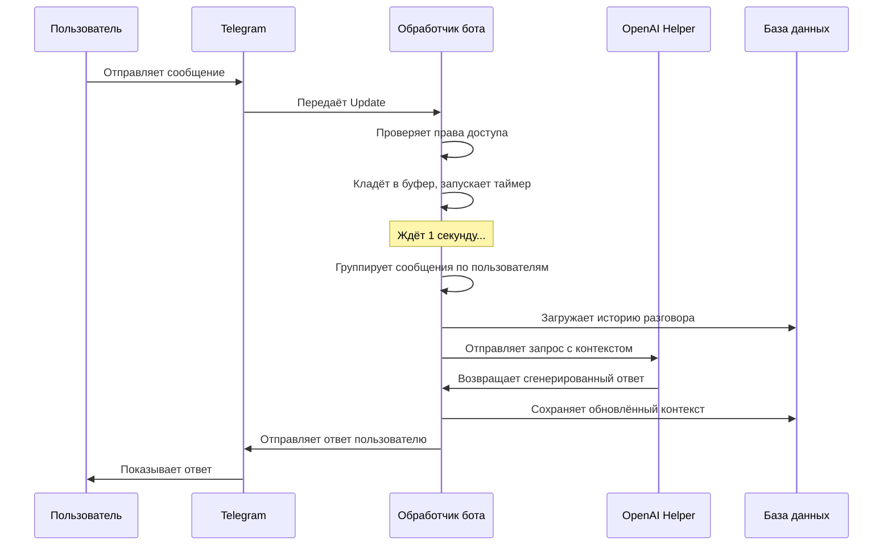

# Chapter 1: Обработчик телеграм-бота

Добро пожаловать в первую главу нашего руководства! Здесь мы познакомимся с самым сердцем проекта `chatgpt-telegram-bot` — **обработчиком телеграм-бота**. Это тот компонент, который принимает ваши сообщения, понимает, чего вы хотите, и организует диалог с искусственным интеллектом.

## Зачем нужен обработчик?

Представьте, что вы заходите в кафе. Вас встречает официант: принимает заказ, передаёт его на кухню, следит, чтобы еда приготовилась вовремя, и приносит готовое блюдо. **Обработчик телеграм-бота** — это именно такой «официант» для вашего чата с ChatGPT.

Без него бот был бы просто «глухим» куском кода, который не понимает, что с ним пытаются сказать. Обработчик решает ключевую задачу: **связывает сообщения пользователя в Telegram с мощью языковых моделей OpenAI**.

### Конкретный пример

Вы пишете боту: *«Привет! Объясни мне квантовую физику простыми словами»*. Вот что происходит:

1. Telegram отправляет это сообщение вашему боту
2. **Обработчик** ловит сообщение, проверяет права доступа
3. Передаёт текст в OpenAI Helper для генерации ответа
4. Получает ответ и отправляет его обратно вам
5. Сохраняет историю разговора для контекста

Всё это — работа одного центрального компонента, который мы изучим в этой главе.

## Ключевые концепции обработчика

### 1. Класс `ChatGPTTelegramBot` — «мозговой центр»

Весь обработчик живёт в одном главном классе. Давайте посмотрим, как он создаётся:

```python
# bot/telegram_bot.py
class ChatGPTTelegramBot:
    def __init__(self, config: dict, openai: OpenAIHelper, db: Database):
        self.config = config          # Настройки бота
        self.openai = openai          # Помощник для работы с OpenAI
        self.db = db                  # База данных для хранения истории
        self.message_buffer = {}      # Буфер для сбора сообщений
        self.buffer_timeout = 1.0     # Задержка перед обработкой (1 секунда)
```

**Что здесь происходит:** При создании бота мы «подключаем» три вещи: конфигурацию (настройки), помощника OpenAI (умную часть) и базу данных (память). Также создаётся «буфер сообщений» — временное хранилище, куда складываются сообщения перед обработкой.

### 2. Буферизация сообщений — «корзина для покупок»

Представьте, что вы в супермаркете: вместо того чтобы бежать на кассу с каждым товаром по отдельности, вы складываете всё в корзину, а потом разом проходите на кассу. **Буфер сообщений** работает так же — он собирает несколько сообщений подряд, чтобы обработать их вместе:

```python
# Добавление сообщения в буфер
async with self.buffer_lock:
    if chat_id not in self.message_buffer:
        self.message_buffer[chat_id] = {
            'messages': [],       # Список сообщений
            'processing': False,  # Флаг «уже обрабатываем?»
            'timer': None         # Таймер ожидания
        }
    
    # Кладём сообщение в «корзину»
    buffer_data['messages'].append({
        'text': prompt,
        'update': update,
        'message_id': message_id
    })
```

**Зачем это нужно:** Если пользователь быстро отправляет несколько коротких сообщений (например, разбивает длинную мысль на части), бот соберёт их вместе и обработает как одно целое. Это делает диалог естественнее.

### 3. Таймер обработки — «кнопка вызова официанта»

После того как сообщение попало в буфер, запускается таймер:

```python
# Запуск таймера (если ещё не запущен)
if buffer_data['timer'] is None or buffer_data['timer'].done():
    buffer_data['timer'] = asyncio.create_task(
        self._delayed_process_buffer(chat_id)  # Ждём 1 секунду
    )
```

**Как это работает:** Бот ждёт `buffer_timeout` секунд (по умолчанию 1 секунда). Если за это время пришли ещё сообщения — они добавляются в ту же «корзину». Когда время вышло, начинается обработка.

### 4. Обработка сообщения — «путь от заказа до блюда»

Когда таймер срабатывает, вызывается главный метод `process_message`. Вот упрощённая схема:

```python
async def process_message(self, prompt: str, update: Update, context: ContextTypes.DEFAULT_TYPE):
    # Получаем «ключ разговора» — уникальный идентификатор чата
    conversation_key = get_conversation_key(update)
    
    # Берём «замок» на разговор, чтобы не мешать самому себе
    conversation_lock = await self._get_conversation_lock(conversation_key)
    
    async with conversation_lock:
        # Главная работа происходит здесь
        return await self._process_message_locked(prompt, update, context)
```

**Почему нужен «замок»:** Представьте, что вы одновременно задаёте два вопроса. Без замка ответы могли бы перемешаться! `asyncio.Lock()` гарантирует, что каждый разговор обрабатывается последовательно.

## Как это выглядит изнутри: пошаговая диаграмма



## Главный метод: обработка с «замком»

Теперь заглянем внутрь `_process_message_locked` — сердце обработчика. Вот ключевые этапы (упрощённо):

### Проверка групповых чатов

```python
# В группе бот реагирует только на специальное слово-триггер
if is_group_chat(update):
    trigger_keyword = self.config['group_trigger_keyword']
    
    # Сообщение должно начинаться с ключевого слова, например "/chat"
    if prompt.lower().startswith(trigger_keyword.lower()):
        prompt = prompt[len(trigger_keyword):].strip()  # Убираем триггер
    else:
        return  # Игнорируем сообщение без триггера
```

**Аналогия:** В шумном офисе вы отзываетесь только когда вас зовут по имени. В групповом чате бот «отзывается» только на своё «имя» — ключевое слово.

### Режим потоковой передачи (streaming)

```python
if self.config['stream']:
    # Ответ приходит частями, как в настоящем разговоре
    stream_response = self.openai.get_chat_response_stream(
        chat_id=chat_id,
        query=prompt,
        user_id=user_id
    )
    
    sent_message = None
    async for content, tokens in stream_response:
        # Первый кусочек — создаём новое сообщение
        if i == 0:
            sent_message = await update.effective_message.reply_text(text=content)
        # Последующие — редактируем то же сообщение
        else:
            await edit_message_with_retry(context, chat_id, 
                str(sent_message.message_id), text=content)
```

**Почему это круто:** Вместо того чтобы ждать полного ответа 30 секунд, пользователь видит, как текст **появляется по частям** — слово за словом, как при печати.

### Режим без потоковой передачи

```python
else:
    # Полный ответ приходит одним блоком
    response, total_tokens = await self.openai.get_chat_response(
        chat_id=chat_id,
        query=prompt,
        user_id=user_id
    )
    
    # Разбиваем длинный ответ на части (лимит Telegram — 4096 символов)
    chunks = split_into_chunks(response)
    
    for index, chunk in enumerate(chunks):
        await update.effective_message.reply_text(text=chunk)
```

**Когда используется:** Для моделей, которые не поддерживают потоковую передачу (Anthropic, Google и др.), или когда streaming отключён в настройках.

## Запуск бота: точка входа

Всё начинается в `bot/__main__.py`. Вот как собираются компоненты:

```python
# Создаём менеджер плагинов
plugin_manager = PluginManager(config=plugin_config)

# Подключаем базу данных
db = Database()

# Создаём помощника OpenAI (мозг бота)
openai_helper = OpenAIHelper(config=openai_config, plugin_manager=plugin_manager, db=db)

# Создаём и запускаем обработчик Telegram
telegram_bot = ChatGPTTelegramBot(
    config=telegram_config, 
    openai=openai_helper, 
    db=db
)
telegram_bot.run()
```

**Что здесь происходит:** Сначала создаются вспомогательные компоненты ([Менеджер плагинов](09_менеджер_плагинов.md), [База данных](08_база_данных.md), [Помощник OpenAI](06_помощник_openai.md)), а потом они «внедряются» в обработчик бота. Этот паттерн называется **внедрение зависимостей** — обработчик не создаёт компоненты сам, а получает готовые.

## Регистрация обработчиков команд

В методе `run()` бот «учится» распознавать команды:

```python
# Основные команды
application.add_handler(CommandHandler('help', self.help))
application.add_handler(CommandHandler('reset', self.reset))
application.add_handler(CommandHandler('settings', self.settings))
application.add_handler(CommandHandler('image', self.image))
application.add_handler(CommandHandler('tts', self.tts))
application.add_handler(CommandHandler('stats', self.stats))

# Обработка обычных сообщений (не команд)
application.add_handler(MessageHandler(
    filters.TEXT & ~filters.COMMAND & ~filters.REPLY,
    self.prompt  # ← главный обработчик диалога!
))
```

**Как это работает:** Telegram отправляет боту `Update` — объект с информацией о событии. `CommandHandler` ловит сообщения, начинающиеся с `/`. `MessageHandler` с фильтром `filters.TEXT` ловит обычный текст — и передаёт в `self.prompt`, который мы разобрали выше.

## Индикатор «печатает...»

Чтобы пользователь не нервничал в ожидании, бот показывает индикатор:

```python
# wrap_with_indicator — обёртка, которая показывает «печатает...»
await wrap_with_indicator(
    update, 
    context, 
    _reply,           # Функция с основной работой
    constants.ChatAction.TYPING  # Индикатор «печатает»
)
```

**Эффект:** В чате появляется надпись «Бот печатает...» — пользователь понимает, что его не игнорируют.

## Что мы узнали

В этой главе мы разобрали **обработчик телеграм-бота** — центральный компонент, который:

| Концепция | Аналогия | Зачем нужна |
|-----------|----------|-------------|
| Буфер сообщений | Корзина в супермаркете | Собирает быстрые сообщения вместе |
| Таймер | Кнопка вызова официанта | Даёт время «добрать» сообщения |
| Замок разговора | Очередь в кассу | Не даёт сообщениям перемешаться |
| Потоковая передача | Живой разговор | Показывает ответ по частям |
| Индикатор «печатает» | «Минуточку!» в кафе | Успокаивает пользователя |

Обработчик — это «связующее звено» между миром Telegram (сообщения, кнопки, чаты) и миром искусственного интеллекта (модели, токены, контекст). Он не генерирует ответы сам, но **организует весь процесс**: от приёма сообщения до доставки ответа.

В следующей главе мы заглянем под капот персонализации — узнаем, как бот запоминает предпочтения каждого пользователя: язык, голос для озвучки, включённые плагины и многое другое. Это мир [Настройки пользователя](02_настройки_пользователя.md)!

---

Generated by MultiAgent