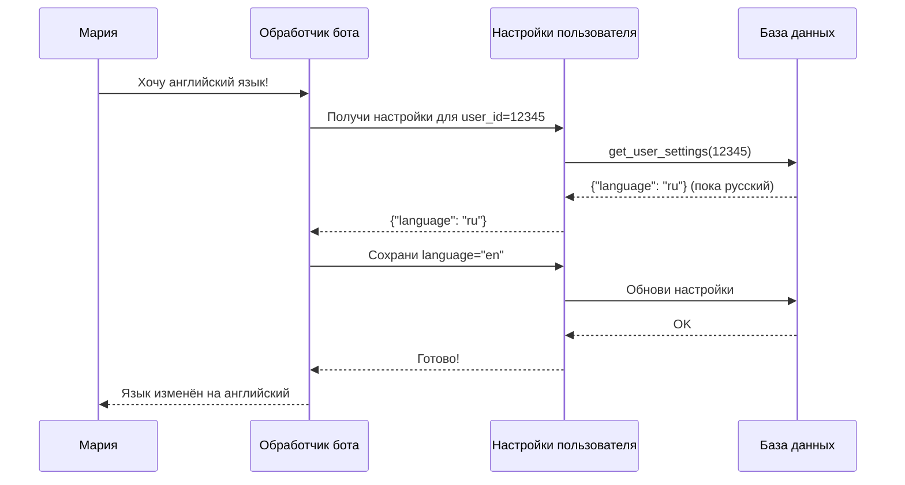

# Chapter 2: Настройки пользователя

В [предыдущей главе](01_обработчик_телеграм_бота.md) мы узнали, как бот принимает сообщения и организует диалог. Но представьте: вы и ваш друг пользуетесь одним и тем же ботом, и каждому нужно своё — вам удобно на русском языке, ему на английском; вы любите голосовые ответы женским голосом, а он предпочитает текст. Как бот понимает, кто как хочет? Вот здесь на сцену выходят **настройки пользователя**.

## Зачем нужны персональные настройки?

Представьте общую кухню в общежитии. У каждого жильца — свой шкафчик с любимым чаем, своё полотенце, свои привычки. Если всё смешать в одну кучу, начнётся хаос. **Настройки пользователя** — это именно такие «личные шкафчики» внутри бота: каждый пользователь получает свой набор предпочтений, и бот помнит, что именно этому человеку нравится.

### Конкретный пример

Мария пишет боту: *«Переключись на английский и включи голосовые ответы»*. Алексей в это же время просит: *«Отключи для меня плагин веб-поиска»*. Бот должен:

1. Запомнить, что Мария теперь говорит по-английски и любит голос
2. Запомнить, что Алексею не нужен веб-поиск
3. Никогда не путать их предпочтения

Всё это возможно благодаря системе настроек, которую мы разберём сейчас.

## Ключевые концепции

### 1. Что хранится в настройках?

Откройте файл `bot/user_settings.py`. Там перечислены «полки нашего шкафчика»:

```python
# bot/user_settings.py
USER_LANGUAGE_SETTING = "language"          # язык общения
USER_TTS_MODEL_SETTING = "tts_model"         # модель озвучки
USER_TTS_VOICE_SETTING = "tts_voice"         # голос для речи
USER_DISABLED_PLUGINS_SETTING = "disabled_plugins"  # выключенные плагины
USER_DISABLED_SKILLS_SETTING = "disabled_skills"    # выключенные навыки
```

Это просто имена полей — как этикетки на коробках. Каждая коробка хранит одно предпочтение пользователя.

### 2. Безопасное чтение настроек

Что если пользователь совсем новый и ещё ничего не настраивал? Или что если база данных временно недоступна? Функция `get_user_settings` защищает от таких ситуаций:

```python
def get_user_settings(db, user_id):
    # Нет ID? Возвращаем пустой словарь
    if user_id is None:
        return {}
    
    # Проверяем, есть ли метод для чтения из базы
    getter = getattr(db, "get_user_settings", None)
    if not callable(getter):
        return {}
    
    # Читаем и гарантируем, что это словарь
    return ensure_settings_dict(getter(user_id) or {})
```

**Как это работает:** функция осторожно спрашивает базу данных о настройках. Если что-то пошло не так — возвращает пустой словарь `{}`, и бот просто использит значения по умолчанию.

### 3. Работа со списками: включить/выключить

Некоторые настройки — это списки. Например, «отключённые плагины». Функция `set_disabled_value` аккуратно добавляет или убирает элемент из такого списка:

```python
def set_disabled_value(settings, key, value, disabled):
    # Берём текущий список и очищаем его
    values = set(normalize_string_list(settings.get(key)))
    
    if disabled:
        values.add(value)      # выключаем — добавляем в список
    else:
        values.discard(value)  # включаем — убираем из списка
    
    settings[key] = sorted(values)  # сохраняем отсортированный список
```

**Пример использования:**
- Алексей хочет отключить плагин `web_search`: `set_disabled_value(settings, "disabled_plugins", "web_search", True)`
- Потом передумал и включил обратно: `set_disabled_value(settings, "disabled_plugins", "web_search", False)`

## Как это работает изнутри

### Шаг за шагом: бот узнаёт предпочтения Марии



### Вспомогательные функции: «подушки безопасности»

Две маленькие функции защищают от «грязных» данных:

```python
def ensure_settings_dict(settings):
    # Если пришло не словарь — делаем пустой словарь
    return settings if isinstance(settings, dict) else {}
```

```python
def normalize_string_list(value):
    # Если не список — делаем пустой список
    if not isinstance(value, list):
        return []
    
    # Очищаем строки: убираем пробелы, пустые, дубликаты
    return sorted({
        item
        for item in (str(item).strip() for item in value)
        if item
    })
```

**Аналогия:** `normalize_string_list` — как приёмщик в прачечной. Он берёт кучу вещей, выбрасывает мусор, убирает пыль (пробелы), складывает одинаковые вещи вместе (убирает дубликаты) и выдаёт аккуратную стопку по алфавиту.

## Связь с другими частями системы

Настройки пользователя — это «мост» между многими компонентами:

| Настройка | Где используется |
|-----------|----------------|
| `language` | [Интернационализация](04_интернационализация.md) — выбирает язык ответов |
| `tts_model`, `tts_voice` | Голосовые ответы — как говорить |
| `disabled_plugins` | [Менеджер плагинов](09_менеджер_плагинов.md) — что не загружать |
| `disabled_skills` | [Система навыков](12_система_навыков.md) — какие умения отключить |

Если включён плагин `hindsight_memory` и Hindsight настроен, меню Settings
показывает отдельный пункт **Hindsight memory**. Оттуда пользователь видит,
включена ли память, сколько воспоминаний найдено в его bank, и может перейти
к ручному поиску, экспорту или очистке через `/memory`.

Обработчик из [первой главы](01_обработчик_телеграм_бота.md) вызывает `get_user_settings` при каждом сообщении, чтобы знать, как именно обслужить этого конкретного пользователя.

## Практический пример: полный цикл

```python
# Получаем настройки при старте диалога
settings = get_user_settings(db, user_id=12345)
# Результат: {"language": "ru", "disabled_plugins": ["web_search"]}

# Мария просит включить веб-поиск
set_disabled_value(settings, "disabled_plugins", "web_search", False)
# Теперь settings: {"language": "ru", "disabled_plugins": []}

# Сохраняем обратно в базу
db.set_user_settings(user_id=12345, settings=settings)
```

## Заключение

В этой главе мы разобрали «личные шкафчики» бота — систему **настроек пользователя**. Узнали, как бот безопасно читает предпочтения, аккуратно работает со списками и не путает одного пользователя с другим. Это фундамент для всего персонализированного опыта.

В следующей главе мы увидим, как настройки работают на практике, когда бот переключается между разными способами общения — изучим [Режимы чата](03_режимы_чата.md).

---

Generated by MultiAgent
