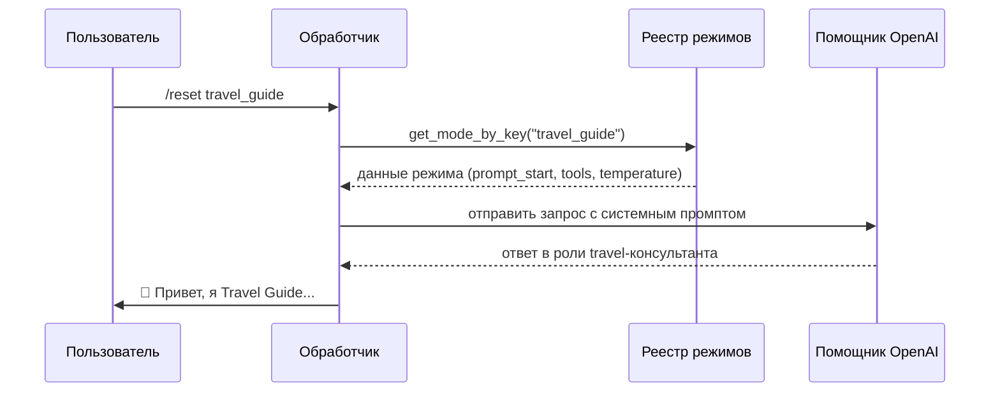

# Chapter 3: Режимы чата

В [предыдущей главе](02_настройки_пользователя.md) мы узнали, как бот запоминает личные предпочтения каждого пользователя — язык, голос, любимые плагины. Но представьте: вы пишете боту сначала о путешествии в Японию, потом просите помочь с кодом на Python, а затем хотите, чтобы он стихи сочинил. Одна и та же нейросеть должна вести себя совершенно по-разному! Как бот понимает, в какой «шкурке» ему сейчас работать? Вот здесь на сцену выходят **режимы чата**.

## Зачем нужны режимы чата?

Представьте универсального актёра в театре. Утром он играет детектив Шерлока Холмса, днём — шеф-повара в кулинарном шоу, а вечером — психолога в драме. Для каждой роли у него свой сценарий, свой стиль речи, свои реквизиты. **Режимы чата** — это именно такие «роли» для нашего бота: каждый режим даёт нейросети чёткие инструкции, кем она сейчас является и как должна себя вести.

### Конкретный пример

Мария открывает бот и пишет: *«Привет! Помоги спланировать поездку в Киото»*. Бот мгновенно переключается в режим 🧳 **Travel Guide** — становится опытным консультантом по туризму, использует инструменты поиска отелей и маршрутов, даёт советы о сезонных особенностях.

Потом она пишет: *«/reset code_assistant»* и просит: *«Напиши функцию сортировки на Python»*. Бот тут же превращается в 👩🏼‍💻 **Code Assistant** — строго следит за синтаксисом, даёт рабочий код с примерами, не отвлекаясь на туристические байки.

Наконец, она переключается в 🍽️ **Шеф-повар** и спрашивает рецепт рамена. Бот ищет продукты через «ВкусВилл», предлагает замены для веганов, даёт пошаговые инструкции с точными пропорциями.

Всё это — один и тот же бот, но в трёх разных «костюмах». Давайте разберём, как это устроено.

## Ключевые концепции

### 1. Файл-реестр `chat_modes.yml` — «сценарий для каждой роли»

Все режимы хранятся в одном файле. Откройте `bot/chat_modes.yml` — это театральная кулиса, где висят все костюмы:

```yaml
# bot/chat_modes.yml
assistant:
  name: 👩🏼‍🎓 Ассистент по общим вопросам
  group: 1. Общие
  temperature: 0.6
  welcome_message: 👩🏼‍🎓 Привет, я <b>Ассистент...</b>
  prompt_start: |
    Вы - продвинутый AI-ассистент...
```

Каждый режим — это блок с уникальным ключом (`assistant`, `code_assistant`, `travel_guide` и т.д.). Внутри блока лежит «инструкция для актёра»:

| Поле | Что означает | Пример |
|------|-----------|--------|
| `name` | Человеческое название с эмодзи | `👩🏼‍🎓 Ассистент по общим вопросам` |
| `group` | Группа для меню | `1. Общие`, `2. Программирование` |
| `temperature` | «Креативность» ответов (0 = строго, 1 = фантазёр) | `0.2` для кода, `0.8` для художника |
| `welcome_message` | Приветствие при переключении | `👩🏼‍🎓 Привет, я <b>Ассистент...</b>` |
| `prompt_start` | Системный промпт — главная «роль» | `Вы - опытный разработчик...` |
| `tools` | Доступные инструменты | `All`, `web_research`, `codeinterpreter` |

### 2. Класс `ChatMode` — «карточка роли»

В коде каждый режим представлен простым классом-контейнером:

```python
# bot/chat_modes_registry.py
@dataclass
class ChatMode:
    key: str          # техническое имя: "travel_guide"
    data: Dict        # все поля из YAML: name, prompt_start, tools...
```

Это как удостоверение актёра: на нём написано, кто он сегодня, и приложена полная инструкция по поведению.

### 3. `ChatModesRegistry` — «театральный режиссёр»

Реестр следит за всеми режимами, подгружает их из файла и выдаёт нужный по запросу:

```python
# bot/chat_modes_registry.py
class ChatModesRegistry:
    def __init__(self, path: str):
        self.path = Path(path)
        self._data: Dict[str, Dict] = {}
```

Главная фишка: **горячая перезагрузка**. Если админ изменил `chat_modes.yml` — не нужно перезапускать бот! Реестр сам заметит, что файл обновился, и подгрузит новые версии.

## Как пользоваться режимами

### Переключение режима

Пользователь пишет команду `/reset <ключ_режима>` или выбирает из меню. Вот что происходит:

```python
# Упрощённый пример из обработчика
mode_key = "travel_guide"  # выбрал пользователь
mode_data = registry.get_mode_by_key(mode_key)
# получили словарь с name, prompt_start, tools...
```

Бот теперь знает: «Я — Travel Guide, у меня temperature=0.7, доступен веб-поиск, и я должен советовать про отели».

### Как бот «надевает костюм»

Внутри [обработчика](01_обработчик_телеграм_бота.md) происходит волшебство:

```python
# Упрощённый псевдокод
system_prompt = mode_data["prompt_start"]  # «Вы - опытный travel-консультант...»
temperature = mode_data["temperature"]      # 0.7
available_tools = mode_data["tools"]        # ["web_research", "ddg_web_search", ...]
```

Эти три вещи передаются в [Помощник OpenAI](06_помощник_openai.md), и нейросеть начинает «играть роль».

### Пример: сравним два режима

**Запрос:** *«Как добраться из аэропорта Нарита до Токио?»*

| Режим | Что делает бот | Какие инструменты использует |
|-------|-------------|---------------------------|
| `travel_guide` | Даёт туристические советы, рекомендует поезда, упоминает пасмурный сезон | `web_research`, `website_content` |
| `code_assistant` | Пишет Python-скрипт для парсинга расписания поездов | `github_analysis`, `show_me_diagrams` |
| `accountant` | Считает, во сколько обойдётся поездка в валюте компании | `codeinterpreter`, `web_research` |

Один вопрос — три совершенно разных ответа, потому что «костюм» задаёт поведение.

## Внутреннее устройство: шаг за шагом

### Последовательность работы при переключении режима



### Горячая перезагрузка: как это работает

Реестр не читает файл при каждом запросе — он умный:

```python
# bot/chat_modes_registry.py
def _load_if_needed(self) -> None:
    mtime = self.path.stat().st_mtime  # время последнего изменения файла
    if self._mtime is None or mtime != self._mtime:
        # Файл изменился! Перечитываем:
        with open(self.path, "r", encoding="utf-8") as f:
            self._data = yaml.safe_load(f)
        self._mtime = mtime  # запоминаем новое время
```

Это как библиотекарь, который смотрит на дату штампа на книге. Если книга не менялась — не открывает. Если свежая печать — перечитывает оглавление.

### Поиск режима по содержимому

Интересная фишка: реестр может угадать режим по самому системному промпту:

```python
# bot/chat_modes_registry.py
def get_mode_by_system_prompt(self, system_content: str) -> Optional[Dict]:
    # Сначала точное совпадение
    for mode_data in self._data.values():
        if mode_data.get("prompt_start", "").strip() == system_content.strip():
            return mode_data
    
    # Или по «маркерам» — ключевым словам
    normalized = system_content.lower()
    for mode_data in self._data.values():
        markers = mode_data.get("prompt_markers") or []
        if markers and all(m.lower() in normalized for m in markers):
            return mode_data
```

Это нужно, когда бот восстанавливает историю диалога и не помнит, в каком режиме общался. Он смотрит на системный промпт в истории и говорит: *«Ага, тут написано "локальные skills" и "skills." — значит, это был Skills Agent!»*

### Проверка инструментов

Реестр заботится, чтобы режимы не просили несуществующие инструменты:

```python
# bot/chat_modes_registry.py
def validate_tools(self, plugin_manager) -> None:
    for mode_key, mode_data in self._data.items():
        tools = mode_data.get("tools", [])
        missing = [t for t in tools 
                   if t not in ("All", "None") 
                   and not plugin_manager.has_plugin(t)]
        if missing:
            logger.error(f"Режим '{mode_key}' просит несуществующие tools: {missing}")
```

Это как костюмер, который проверяет: «В сценарии написано «взять меч», а на реквизитной полке его нет — кричать режиссёру!»

## Как добавить свой режим

Хотите создать режим «Финансовый консультант»? Достаточно добавить блок в `chat_modes.yml`:

```yaml
finance_guru:
  name: 💰 Финансовый гуру
  group: 4. Бизнес
  temperature: 0.3
  welcome_message: 💰 Привет, я <b>Финансовый гуру</b>. Спрошу про ваш бюджет и помогу разобраться.
  prompt_start: |
    Вы - опытный финансовый консультант...
    [ваши инструкции]
  tools:
    - web_research
    - codeinterpreter
```

Сохранили файл — и сразу можно использовать! Бот подхватит без перезапуска.

## Заключение

В этой главе мы узнали, что **режимы чата** — это театральные костюмы для бота. Они хранятся в файле `chat_modes.yml`, управляются классом `ChatModesRegistry`, и каждый режим задаёт нейросети роль через системный промпт, температуру и набор инструментов.

Ключевое, что нужно запомнить:
- Режим = роль + инструменты + стиль поведения
- Переключение происходит мгновенно, без перезапуска бота
- Можно добавлять свои режимы, просто редактируя YAML-файл

Теперь бот умеет быть кем угодно — от шеф-повара до программиста. Но как он разговаривает с пользователями из разных стран? Как понимает «привет» на японском и «hello» на английском? В [следующей главе](04_интернационализация.md) мы разберём систему **интернационализации** — как бот говорит на языке каждого пользователя.

---

Generated by MultiAgent