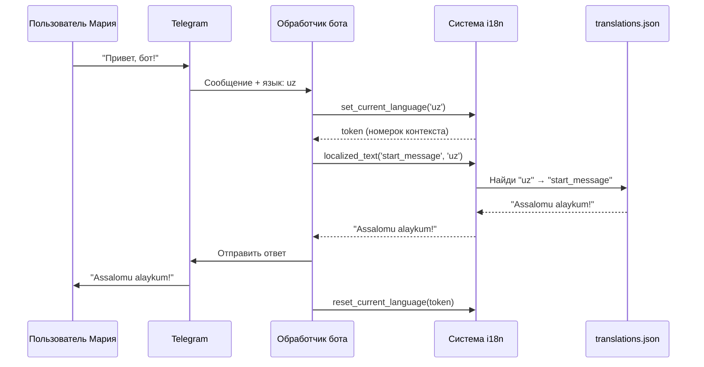

# Chapter 4: Интернационализация

В [предыдущей главе](03_режимы_чата.md) мы узнали, как бот переключается между разными «ролями» — туристическим гидом, программистом, шеф-поваром. Но представьте: Мария переключилась в режим путешественника и просит спланировать поездку в Киото... а бот отвечает ей по-английски! Или Алексей, выбрав режим программирования, получает подсказки на китайском. Как бот понимает, на каком языке говорить с каждым пользователем? Вот здесь на сцену выходит **интернационализация** — способность бота говорить с людьми на их родном языке.

## Зачем нужна интернационализация?

Представьте, что вы пришли в международный аэропорт. Там есть табло, которое показывает рейсы на двадцати языках. Но вот незадача: если бы табло было только на английском, пассажир из Узбекистана или Вьетнама просто не понял бы, куда идти. **Интернационализация** — это как умное табло в аэропорту: оно автоматически «переключается» на язык каждого пассажира, чтобы никто не потерялся.

### Конкретный пример

Мария из Ташкента открывает бот. Её Telegram настроен на узбекский язык. Бот мгновенно приветствует её: «*Assalomu alaykum! Sizga qanday yordam bera olaman?*»

Её друг Пьер из Парижа в это же время пишет боту. Бот отвечает: «*Bonjour ! Comment puis-je vous aider aujourd'hui ?*» — хотя это совершенно другой человек, и диалог идёт параллельно!

А вот Алексей из Москвы специально выбрал в настройках английский, чтобы тренироваться. Бот учтёт его личный выбор и ответит: «*Hello! How can I help you?*»

Всё это возможно благодаря системе, которую мы разберём сейчас.

## Ключевые концепции

### 1. «Словарь» переводов — файл `translations.json`

Представьте большой словарь, где каждой фразе на английском соответствует перевод на множество языков. Вот как это устроено:

```json
{
  "en": {
    "help_description": "Available commands",
    "start_message": "Hello! How can I help you?"
  },
  "ru": {
    "help_description": "Доступные команды",
    "start_message": "Привет! Чем могу помочь?"
  },
  "uz": {
    "help_description": "Mavjud buyruqlar",
    "start_message": "Assalomu alaykum! Sizga qanday yordam bera olaman?"
  }
}
```

Каждый язык — это отдельная «колонка» в нашем словаре. Ключи (`help_description`, `start_message`) — это «адреса», по которым бот находит нужную фразу.

### 2. Язык по умолчанию и автоопределение

Что если бот встретит язык, которого нет в словаре? Или если пользователь хочет, чтобы бот сам угадал язык из Telegram?

```python
# bot/i18n.py
DEFAULT_LANGUAGE = 'en'      # запасной вариант — английский
AUTO_LANGUAGE = 'auto'       # специальное значение «угадать самому»
```

`DEFAULT_LANGUAGE` — это как запасное колесо: если что-то пошло не так, бот всегда сможет объясниться на английском.

`AUTO_LANGUAGE` — это режим «пусть Telegram решает». Бот посмотрит, какой язык выбран в настройках приложения у пользователя, и попробует подстроиться.

### 3. Нормализация языка — приведение к «стандарту»

Пользователи пишут языки по-разному: `ru`, `RU`, `rus`, `Russian`, `русский`. Как бот не запутается?

```python
# bot/i18n.py
def normalize_language(bot_language):
    # Приводим к нижнему регистру и заменяем подчёркивания
    language = str(bot_language).strip().lower().replace('_', '-')
    
    # Проверяем псевдонимы: 'iw' → 'he' (иврит), 'pt' → 'pt-br'
    language = LANGUAGE_ALIASES.get(language, language)
    
    # Проверяем, есть ли такой язык в словаре
    if language in translations:
        return language
    
    # Пробуем базовую часть: 'zh-cn' → 'zh' нет? тогда 'zh-cn'
    base = language.split('-', 1)[0]
    if base in translations:
        return base
    
    return DEFAULT_LANGUAGE  # ничего не подошло — на английский
```

Это как когда вы говорите бариста «хочу кофе», «кофеёк», «кофан» — бариста понимает, что вы имеете в виду одно и то же, и готовит эспрессо.

### 4. Контекстный язык — «память на один разговор»

Представьте, что бот одновременно говорит с сотней людей. Как он помнит, кто на каком языке?

```python
# bot/i18n.py
from contextvars import ContextVar

_current_language = ContextVar('current_language', default=None)

def set_current_language(bot_language):
    # Устанавливаем язык для ТЕКУЩЕГО диалога
    return _current_language.set(normalize_language(bot_language))

def get_current_language():
    # Получаем язык текущего диалога, или английский по умолчанию
    return _current_language.get() or DEFAULT_LANGUAGE
```

`ContextVar` — это волшебная коробочка: каждый разговор получает свою собственную, и они не мешают друг другу. Это как номерки в гардеробе — у каждого посетителя свой, и пальто не перепутаются.

## Как пользоваться системой: пошаговый пример

Допустим, мы хотим, чтобы бот приветствовал пользователя на его языке. Вот что происходит:

### Шаг 1: Бот получает сообщение и узнаёт язык пользователя

```python
# Внутри обработчика сообщения (см. [Обработчик телеграм-бота](01_обработчик_телеграм_бота.md))
from bot.i18n import set_current_language, get_current_language

# Узнаём язык из настроек пользователя (см. [Настройки пользователя](02_настройки_пользователя.md))
user_lang = user_settings.get('language', 'auto')

# Устанавливаем язык для этого конкретного разговора
token = set_current_language(user_lang)
```

### Шаг 2: Бот «берёт» нужную фразу из словаря

```python
# bot/i18n.py
def localized_text(key, bot_language):
    # Сначала смотрим: не установили ли мы язык вручную?
    current = get_current_language()
    
    if current:
        language = current           # используем язык текущего диалога
    elif is_auto_language(bot_language):
        language = DEFAULT_LANGUAGE  # авто → пока английский
    else:
        language = normalize_language(bot_language)
    
    # Ищем перевод в словаре
    try:
        return translations[language][key]
    except KeyError:
        # Нет перевода? Возвращаем английский вариант
        return translations[DEFAULT_LANGUAGE].get(key, key)
```

### Шаг 3: Используем в коде обработчика

```python
# Где-то в обработчике Telegram-бота
from bot.i18n import localized_text, reset_current_language

# Получаем приветствие на языке пользователя
greeting = localized_text('start_message', user_lang)
# Для Марии: "Assalomu alaykum!..."
# Для Пьера: "Bonjour !..."
# Для Алексея (выбрал английский): "Hello!..."

# Отправляем сообщение
await update.message.reply_text(greeting)

# Очищаем язык текущего диалога
reset_current_language(token)
```

## Что происходит «под капотом»

Давайте проследим путь одной фразы от запроса до ответа:



## Внутреннее устройство: кэш и псевдонимы

### Кэширование нормализации

Чтобы не превращать `RU` в `ru` тысячу раз, система запоминает результат:

```python
# bot/i18n.py
from functools import lru_cache

@lru_cache(maxsize=None)
def normalize_language(bot_language):
    # Результат сохраняется в «кэше» — быстрая память
    ...
```

Это как записать часто используемый номер телефона в избранное — не нужно листать записную книжку каждый раз.

### Таблица псевдонимов языков

Мир языковых кодов хаотичен. Вот как система приводит его к порядку:

```python
# bot/i18n.py
LANGUAGE_ALIASES = {
    'iw': 'he',        # старый код иврита → новый
    'in': 'id',        # старый код индонезийского → новый
    'pt': 'pt-br',     # португальский → бразильский вариант
    'zh-hans': 'zh-cn',  # упрощённый китайский
    'zh-hant': 'zh-tw',  # традиционный китайский
}
```

Это как когда в разных странах одно и то же блюдо называют по-разному: «пицца» в Италии, «пицца» в России, но вот «французские булочки» в Австрии — это «кифли». Система знает все эти «кухонные» названия.

### Поддерживаемые языки и их человекочитаемые имена

```python
# bot/i18n.py
LANGUAGE_NAMES = {
    'en': 'English',
    'ru': 'Русский',
    'uz': "O'zbek",
    'zh-cn': '简体中文',
    # ... и другие
}
```

Это нужно, например, когда бот показывает меню выбора языка — пользователь видит «Русский», а не загадочный код `ru`.

## Практический пример: добавление нового языка

Допустим, вы хотите добавить казахский язык. Что нужно сделать?

**Шаг 1:** Добавьте запись в `translations.json`:

```json
{
  "kk": {
    "start_message": "Сәлеметсіз бе! Сізге қалай көмектесе аламын?",
    "help_description": "Қолжетімді командалар"
  }
}
```

**Шаг 2:** Добавьте имя языка в `LANGUAGE_NAMES`:

```python
# bot/i18n.py
LANGUAGE_NAMES = {
    # ... другие языки ...
    'kk': 'Қазақша',  # ← добавили!
}
```

**Шаг 3:** Всё! Система автоматически подхватит `kk`, нормализует его, найдёт переводы. Никаких изменений в логике не требуется.

## Заключение

В этой главе мы узнали, как бот учится «говорить» на языках пользователей. Главные идеи:

- **Словарь `translations.json`** хранит все переводы по «адресам»-ключам
- **Нормализация** приводит разные варианты написания к единому стандарту
- **Контекстный язык** (`ContextVar`) позволяет боту вести сотни диалогов на разных языках одновременно
- **Запасной вариант** (`DEFAULT_LANGUAGE`) гарантирует, что бот всегда сможет ответить

Интернационализация тесно связана с [настройками пользователя](02_настройки_пользователя.md) — именно там хранится выбранный язык, и с [обработчиком телеграм-бота](01_обработчик_телеграм_бота.md) — именно он запускает весь процесс при каждом сообщении.

В следующей главе мы заглянем за кулисы ещё глубже: узнаем, как бот **отслеживает использование** — считает токены, следит за расходами и предотвращает злоупотребления. Это как счётчик электроэнергии в умном доме: кто, сколько и когда потратил. Добро пожаловать в [Отслеживание использования](05_отслеживание_использования.md)!

---

Generated by MultiAgent