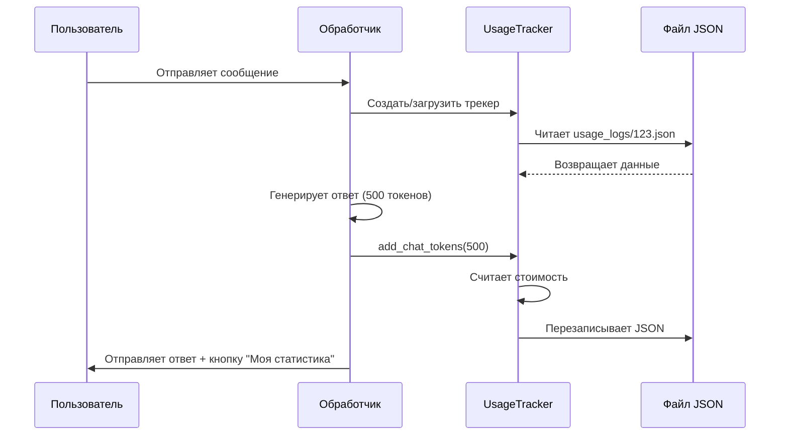

# Chapter 5: Отслеживание использования

В [предыдущей главе](04_интернационализация.md) мы узнали, как бот разговаривает с каждым пользователем на его родном языке — будь то узбекский, французский или русский. Но представьте: Мария целый день просит бота генерировать картинки для её проекта, Пьер диктует боту голосовые сообщения по 10 минут, а Алексей использует сложные режимы с анализом фотографий. Каждая из этих функций стоит денег — API OpenAI, серверы, трафик. Как понять, кто сколько потратил? Не превысили ли мы лимит? Вот здесь на сцену выходит **отслеживание использования** — умный счётчик, который ведёт учёт за каждого пользователя.

## Зачем нужно отслеживать использование?

Представьте общак в съёмной квартире. Жильцы покупают продукты на всех, но кто-то ест только салат, а кто-то — три стейка в день. Без учёта получается несправедливо: салатник платит за стейки. **Отслеживание использования** — это как умный холодильник, который записывает, кто сколько съел, и в конце месяца выдаёт честный отчёт.

### Конкретный пример

Мария с утра до вечера работает с ботом:
- Сгенерировала 5 картинок размером 1024×1024
- Потратила 15 000 токенов на обсуждение проекта
- Отправила 3 голосовых сообщения по 2 минуты каждое
- Попросила озвучить длинный текст — 2000 символов

Бот тихо записывает всё это в её личный журнал. Вечером она пишет: *«Сколько я потратила сегодня?»* — и мгновенно получает ответ: «*Сегодня: $0.47, за месяц: $12.34*».

Администратор бота, глядя на такие цифры, может решить: «Мария, хватит на сегодня» — или наоборот, понять, что бот пользуется спросом и стоит расширить сервер.

## Ключевые концепции

### 1. Что вообще считать?

Откройте файл `bot/usage_tracker.py`. Это «главная бухгалтерия» бота. Вот что она умеет считать:

```python
# bot/usage_tracker.py — структура хранения данных
{
    "user_name": "@maria_designer",
    "current_cost": {
        "day": 0.47,           # потрачено сегодня
        "week": 3.10,          # потрачено за текущую ISO-неделю
        "month": 12.34,        # потрачено за месяц
        "all_time": 156.78,    # всего за всё время
        "last_update": "2024-01-15"
    },
    "usage_history": {
        "chat_tokens": {       # текстовые разговоры
            "2024-01-15": 15000
        },
        "number_images": {      # сгенерированные картинки
            "2024-01-15": [0, 0, 5]  # [256×256, 512×512, 1024×1024]
        },
        "transcription_seconds": {  # голосовые сообщения
            "2024-01-15": 360
        },
        "tts_characters": {   # озвученный текст
            "tts-1": {
                "2024-01-15": 2000
            }
        },
        "vision_tokens": {    # анализ изображений
            "2024-01-15": 800
        }
    }
}
```

Каждый пользователь получает свой JSON-файл в папке `usage_logs/`. Это как личная кредитная карта: все траты записываются именно на неё.

### 2. Как создаётся личный счётчик?

Когда новый пользователь впервые пишет боту, система автоматически заводит ему «паспорт»:

```python
# Создание нового пользователя (упрощённо)
from usage_tracker import UsageTracker

# Первое сообщение от Марии
tracker = UsageTracker(
    user_id=123456789,           # ID в Telegram
    user_name="@maria_designer"  # имя пользователя
)
# Автоматически создаётся файл usage_logs/123456789.json
```

Если файл уже есть — система просто загружает его. Если нет — создаёт пустой шаблон с нулями.

### 3. Добавление токенов разговора

Самое частое — подсчёт токенов в текстовых сообщениях:

```python
# После ответа нейросети из 500 токенов
tracker.add_chat_tokens(tokens=500, tokens_price=0.002)
# Система сама:
# 1. Считает стоимость: 500 × 0.002 / 1000 = $0.001
# 2. Добавляет в today's total
# 3. Сохраняет в JSON-файл
```

Метод `add_chat_tokens` — это как кассир в магазине: пробил товар, добавил в чек, распечатал.

### 4. Подсчёт картинок

Генерация изображений считается поштучно, с разной ценой за размер:

```python
# Мария попросила картинку 1024×1024
tracker.add_image_request(
    image_size="1024x1024",
    image_prices="0.016,0.018,0.02"
)
# 1024×1024 — третий в списке, значит цена $0.02
# Записывается как [0, 0, 1] для сегодняшнего дня
```

Размеры кодируются индексами: 0=256×256, 1=512×512, 2=1024×1024. Это как ценники на полках в магазине — взял с третьей полки, заплатил третью цену.

### 5. Голосовые сообщения и озвучка

Для голоса считаем секунды, для озвучки — символы:

```python
# Мария отправила голосовое на 120 секунд
tracker.add_transcription_seconds(seconds=120, minute_price=0.006)
# Стоимость: 120 × 0.006 / 60 = $0.012

# Попросила озвучить текст длиной 500 символов моделью tts-1
tracker.add_tts_request(
    text_length=500,
    tts_model="tts-1",
    tts_prices=[0.015, 0.030]
)
# tts-1 — первая в списке, цена $0.015 за 1000 символов
```

### 6. Получение текущих расходов

Чтобы показать пользователю его «баланс»:

```python
# Запрос статистики
costs = tracker.get_current_cost()
# Возвращает словарь:
# {
#     "cost_today": 0.47,
#     "cost_week": 3.10,
#     "cost_month": 12.34,
#     "cost_all_time": 156.78
# }
```

## Как это работает «под капотом»

### Пошаговая схема работы

Когда Мария отправляет сообщение боту, внутри происходит следующий танец:



### Внутреннее устройство: обновление стоимости

Самое хитрое — метод `add_current_costs`. Он не просто прибавляет числа, а следит за сменой дней, ISO-недель и месяцев:

```python
# Упрощённая логика из usage_tracker.py
def add_current_costs(self, request_cost):
    today = date.today()           # сегодняшняя дата
    last_update = date.fromisoformat(
        self.usage["current_cost"]["last_update"]
    )
    
    # Добавляем в общий счёт
    self.usage["current_cost"]["all_time"] += request_cost
    
    if today == last_update:
        # Тот же день — просто прибавляем
        self.usage["current_cost"]["day"] += request_cost
        self.usage["current_cost"]["week"] += request_cost
        self.usage["current_cost"]["month"] += request_cost
    else:
        # Новый день! Сбрасываем "day", проверяем неделю и месяц
        if today.isocalendar()[:2] == last_update.isocalendar()[:2]:
            self.usage["current_cost"]["week"] += request_cost
        else:
            self.usage["current_cost"]["week"] = request_cost

        if today.month == last_update.month:
            self.usage["current_cost"]["month"] += request_cost
        else:
            # Новый месяц тоже! Сбрасываем "month"
            self.usage["current_cost"]["month"] = request_cost
        
        self.usage["current_cost"]["day"] = request_cost
        self.usage["current_cost"]["last_update"] = str(today)
```

Это как умный счётчик в квартире: он знает, когда начался новый день, и автоматически обнуляет «сегодняшние» показания, но аккуратно переносит в архив.

### Инициализация при загрузке старых данных

Интересный момент — обратная совместимость. Если у пользователя старый файл без полей `vision_tokens` или `tts_characters`, система не ломается, а добавляет недостающее:

```python
# При загрузке существующего файла
if 'vision_tokens' not in self.usage['usage_history']:
    self.usage['usage_history']['vision_tokens'] = {}
if 'tts_characters' not in self.usage['usage_history']:
    self.usage['usage_history']['tts_characters'] = {}
```

Это как если бы вы нашли старый блокнот с расходами и аккуратно дописали в него новые колонки — «подписки», «доставка еды» — которых раньше не было.

## Как использовать в своём боте

### Пример интеграции с обработчиком сообщений

Вспомним [обработчик телеграм-бота](01_обработчик_телеграм_бота.md). Вот как вплести туда учёт расходов:

```python
# bot/telegram_bot.py — фрагмент обработки ответа
from usage_tracker import UsageTracker

async def handle_message(update, context):
    user_id = update.message.from_user.id
    user_name = update.message.from_user.username
    
    # Загружаем или создаём трекер
    tracker = UsageTracker(user_id, user_name)
    
    # ... получаем ответ от OpenAI ...
    response = await openai_chat_completion(messages)
    
    # Считаем потраченные токены
    tokens_used = response['usage']['total_tokens']
    tracker.add_chat_tokens(tokens_used)
    
    # Отправляем пользователю
    await update.message.reply_text(response['choices'][0]['message']['content'])
```

### Пример команды статистики

Добавим команду `/stats`, чтобы пользователь видел свои расходы:

```python
# Команда /stats
async def stats_command(update, context):
    user_id = update.message.from_user.id
    user_name = update.message.from_user.username
    
    tracker = UsageTracker(user_id, user_name)
    costs = tracker.get_current_cost()
    
    # Форматируем красиво
    message = (
        f"📊 Ваша статистика:\n"
        f"• Сегодня: ${costs['cost_today']:.2f}\n"
        f"• За неделю: ${costs['cost_week']:.2f}\n"
        f"• За месяц: ${costs['cost_month']:.2f}\n"
        f"• За всё время: ${costs['cost_all_time']:.2f}"
    )
    await update.message.reply_text(message)
```

## Практический пример: день из жизни Марии

Давайте проследим, как накапливаются расходы за один день:

```python
# Утро: планирование проекта
tracker.add_chat_tokens(2000)        # $0.004

# Обед: нужны визуалы
tracker.add_image_request("1024x1024")  # $0.02
tracker.add_image_request("1024x1024")  # $0.02
tracker.add_image_request("512x512")    # $0.018

# После обеда: голосовая заметка
tracker.add_transcription_seconds(180)  # $0.018

# Вечер: озвучить презентацию
tracker.add_tts_request(1500, "tts-1", [0.015, 0.030])  # $0.0225

# Итого за день: ~$0.10
```

Каждый раз система тихо дописывает в JSON-файл. Вечером команда `/stats` покажет точную цифру.

## Заключение

В этой главе мы разобрали, как бот ведёт «личную бухгалтерию» для каждого пользователя. **Отслеживание использования** — это не просто скучные цифры, а инструмент справедливости и контроля: пользователи видят свои расходы, администраторы предотвращают злоупотребления, а система масштабируется прозрачно.

Мы узнали:
- Как создаётся персональный трекер для каждого пользователя
- Как считаются токены, картинки, голос и озвучка
- Как система следит за сменой дней, недель и месяцев
- Как интегрировать учёт в обработчик сообщений

В следующей главе мы заглянем ещё глубже — в само сердце бота, где происходит волшебство общения с нейросетью. Узнаем, как бот строит запросы к OpenAI, управляет токенами контекста и получает умные ответы. Добро пожаловать в [Помощник OpenAI](06_помощник_openai.md)!

---

Generated by MultiAgent
