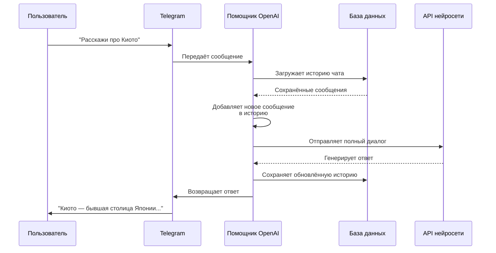

# Chapter 6: Помощник OpenAI

В [предыдущей главе](05_отслеживание_использования.md) мы узнали, как бот ведёт умный учёт токенов и расходов для каждого пользователя — как общак в съёмной квартире, где каждый платит ровно за своё. Но отслеживание — это лишь половина дела. А *как именно* бот генерирует ответы? Как превращает текстовые сообщения в осмысленную речь, картинки в описания, голосовые сообщения в текст? Вот здесь на сцену выходит **Помощник OpenAI** — сердце и мозг нашего бота, которое связывает Telegram с языковыми моделями.

## Зачем нужен Помощник OpenAI?

Представьте, что вы заказываете перевод у профессионального переводчика. Вы говорите по-русски, переводчик знает японский, но между вами нет прямого контакта — есть лишь телефонный секретарь, который принимает ваш звонок, передаёт текст переводчику, получает ответ и зачитывает его вам. **Помощник OpenAI** — это именно такой секретарь: он берёт сообщение из Telegram, «переводит» его в формат, который понимает нейросеть, получает ответ и «переводит» обратно в понятный человеку текст.

### Конкретный пример

Мария отправляет боту голосовое сообщение: *«Привет, расскажи про Киото»*. Без Помощника OpenAI это просто звуковой файл, который Telegram не умеет анализировать. Но Помощник:

1. Скачивает голосовое сообщение
2. Отправляет его в модель Whisper для расшифровки
3. Получает текст: «Привет, расскажи про Киото»
4. Отправляет этот текст в чат-модель GPT
5. Получает красивый ответ про храмы и сакуру
6. Возвращает ответ Марии в Telegram

Всё это происходит за секунды, и Мария даже не подозревает, сколько «переводчиков» участвовало в разговоре.

## Ключевые концепции

### Клиент OpenAI: дипломат с нейросетями

В центре Помощника — **клиент OpenAI**, специальный объект, который умеет разговаривать с серверами языковых моделей. Это как дипломат с пропуском в посольство: он знает, куда идти, как представиться, в какой форме подавать документы.

```python
# Создаём клиент для общения с API нейросетей
client = openai.AsyncOpenAI(
    api_key=config["api_key"],      # Наш пропуск
    base_url=config["openai_base"],  # Адрес посольства
    timeout=300.0,                   # Сколько ждать ответа
    max_retries=3,                   # Сколько раз переспросить при неудаче
)
```

Этот клиент — асинхронный, то есть может ждать ответа от сервера, не блокируя другие задачи бота. Пока одна нейросеть думает над ответом Марии, бот уже может принимать сообщение от Пьера.

### LLMGatewayClient: универсальный переводчик

Помимо стандартного OpenAI, наш Помощник работает с **LLMGateway** — специальным шлюзом, который объединяет множество моделей под одной крышей. Это как универсальный адаптер для розеток: вместо десятка разных зарядок у вас один, который подходит везде.

```python
# Клиент для специальных сервисов: поиска, редактирования картинок, голосов
gateway_client = LLMGatewayClient(
    base_url=config.get("openai_base", ""),
    api_key=config["api_key"],
)
```

Через этот шлюз бот получает доступ к веб-поиску, генерации изображений, редактированию фото, преобразованию текста в речь — всё то, что мы рассмотрим в следующих главах.

### История разговоров: память бота

Помощник хранит **историю разговоров** — список всех сообщений между пользователем и ботом. Это как дневник диалога, который бот перечитывает перед каждым ответом, чтобы не забыть, о чём шла речь.

```python
# Память бота: {идентификатор_чата: [список_сообщений]}
self.conversations: dict[int, list] = {}
```

Каждый чат имеет свой отдельный дневник. Мария обсуждает путешествие в Японию — в её дневнике записи про храмы и сакуру. Пьер спрашивает про Python — в его дневнике код и объяснения.

### Системные сообщения: инструкции для роли

В начале каждого дневника идёт особая запись — **системное сообщение**. Это как должностная инструкция, которую бот получает перед сменой: «Сегодня ты туристический гид», «Теперь ты программист», «А теперь — шеф-повар». Мы подробно разбирали эти роли в главе про [Режимы чата](03_режимы_чата.md).

## Как бот получает ответ: пошаговый разбор

Давайте проследим путь простого текстового сообщения от пользователя до ответа бота.



### Шаг 1: Подготовка диалога

Прежде чем отправлять запрос в нейросеть, Помощник собирает полный контекст разговора. Это как собрать все письма из переписки перед важным совещанием — нельзя же прийти с пустыми руками!

```python
# Загружаем историю из базы данных
saved_context = self.db.get_conversation_context(chat_id, session_id)

if saved_context and 'messages' in saved_context:
    # Восстанавливаем старый дневник
    self.conversations[chat_id] = saved_context['messages']
else:
    # Начинаем новый разговор
    self.reset_chat_history(chat_id, session_id=session_id)
```

### Шаг 2: Добавление сообщения пользователя

Новое сообщение записывается в историю с пометкой «user» — это как внести новую запись в протокол заседания.

```python
# Добавляем сообщение пользователя в историю
self.conversations[chat_id].append({
    "role": "user",
    "content": "Расскажи про Киото"
})
```

### Шаг 3: Выбор модели

Помощник выбирает, какую нейросеть использовать. Это как выбрать специалиста для задачи: для сложного анализа — опытный эксперт, для простого вопроса — достаточно junior-специалиста.

```python
# Получаем подходящую модель для пользователя
model_to_use = self.get_current_model(user_id)

# Проверяем, не слишком ли длинный разговор
token_count = self.__count_tokens(self.conversations[chat_id], model_to_use)
```

Функция `get_current_model` проверяет: есть ли у пользователя активная сессия с выбранной моделью? Если да — использует её. Иначе берёт модель по умолчанию из настроек.

### Шаг 4: Отправка запроса в API

Теперь Помощник формирует «конверт» с письмом для нейросети и отправляет его.

```python
# Формируем параметры запроса
common_args = {
    'model': model_to_use,           # Какую нейросеть спросить
    'messages': self.conversations[chat_id],  # Полный дневник
    'temperature': 0.7,              # Креативность ответа
    'max_tokens': 2000,              # Максимальная длина ответа
    'stream': False,                 # Ждём полный ответ сразу
}

# Отправляем запрос
response = await self.client.chat.completions.create(**common_args)
```

Параметр `temperature` — это как «творческий настрой» переводчика: 0 означает «переводи дословно», 1 — «можно немного импровизировать».

### Шаг 5: Получение и сохранение ответа

Нейросеть возвращает ответ, который Помощник извлекает и добавляет в историю — теперь уже с пометкой «assistant».

```python
# Извлекаем текст ответа из ответа API
answer = response.choices[0].message.content

# Сохраняем ответ бота в историю
self.conversations[chat_id].append({
    "role": "assistant", 
    "content": answer
})
```

### Шаг 6: Добавление статистики (опционально)

Если включено отслеживание использования, Помощник добавляет к ответу информацию о затраченных токенах — мы это изучали в главе про [Отслеживание использования](05_отслеживание_использования.md).

```python
# Добавляем статистику, если пользователь включил её
if self.config['show_usage']:
    answer += f"\n\n💰 {response.usage.total_tokens} токенов"
```

## Потоковая передача: когда ждать невтерпёж

Иногда нейросеть думает долго — особенно на сложных вопросах. Помощник умеет **потоковую передачу** (streaming): отправляет пользователю текст по мере его генерации, слово за словом. Это как слушать радиопередачу в прямом эфире вместо записи на магнитофон.

```python
# Запрашиваем потоковый ответ
response = await self.__common_get_chat_response(
    chat_id, 
    query, 
    stream=True  # Включаем потоковую передачу!
)

# Отправляем пользователю каждую новую порцию текста
async for chunk in response:
    delta = chunk.choices[0].delta
    if delta.content:
        answer += delta.content
        # Показываем промежуточный результат
        yield answer, 'not_finished'
```

Пользователь видит, как бот «печатает» ответ в реальном времени — это значительно приятнее, чем минутное молчание.

## Работа с функциями: когда боту нужны инструменты

Иногда текстового ответа недостаточно — боту нужно что-то *сделать*: поискать в интернете, сгенерировать картинку, выполнить код. Для этого Помощник поддерживает **вызов функций** (tools). Это как дать переводчику не только словарь, но и телефон справочной службы, атлас и калькулятор.

```python
# Получаем список доступных инструментов
tools = self.plugin_manager.get_functions_specs(
    self, 
    model_to_use, 
    allowed_plugins
)

# Если есть инструменты, просим нейросеть их использовать
if tools:
    common_args['tools'] = tools
    common_args['tool_choice'] = 'auto'  # Нейросеть сама решает, нужен ли инструмент
```

Когда нейросеть решает вызвать функцию, Помощник передаёт управление в [Обработчик инструментов](10_обработчик_инструментов.md), который мы изучим позже.

## Специальные возможности

### Генерация изображений

Помощник умеет создавать картинки по описанию через модель DALL·E или LLMGateway:

```python
# Генерация изображения по текстовому описанию
response = await self.client.images.generate(
    prompt="Кот в шляпе на фоне Киото",
    model="llmgateway/ai-klein-generation",
    size="1024x1024",
)
```

### Преобразование текста в речь

Для пользователей, которые предпочитают слушать:

```python
# Генерация голосового сообщения
response = await self.client.audio.speech.create(
    model=self.get_user_tts_model(user_id),
    voice="kseniya",  # Голос Ксении
    input="Киото — бывшая столица Японии",
)
```

### Распознавание речи

И наоборот — превращение голоса в текст:

```python
# Расшифровка аудиофайла
with open("голосовое.ogg", "rb") as audio:
    result = await self.client.audio.transcriptions.create(
        model="llmgateway/whisper-large-v3",
        file=audio,
    )
# result содержит текст: "Расскажи про Киото"
```

## Умная подрезка истории: когда дневник становится толстым

Длинные разговоры стоят дороже — каждое предыдущее сообщение «съедает» токены из лимита. Помощник следит за этим и **суммаризирует** старую историю, когда она разрастается. Это как вести рабочий журнал: вместо тысячи страниц мелких записей вы делаете сводку «главных событий квартала».

```python
# Проверяем, не слишком ли длинный разговор
token_count = self.__count_tokens(self.conversations[state_key], model_to_use)
exceeded_max_tokens = token_count > лимит_модели * 0.95

if exceeded_max_tokens:
    # Заменяем старую половину истории одним system-сообщением-сводкой.
    # На неудачу (throttle / таймаут / пустой ответ) — fallback с
    # head-preserve trim в вызывающем коде.
    summarized = await self._summarize_and_trim(
        state_key,
        chat_id=chat_id,
        session_id=session_id,
        memory_user_id=memory_user_id,
    )
```

## Защита от пустых ответов

Иногда нейросеть возвращает пустой ответ или решает вызвать инструмент, но не даёт финального объяснения. Помощник умеет **переспросить** в таких случаях — как вежливый секретарь, который не уходит с пустыми руками, а уточняет: «Извините, вы не закончили мысль?»

```python
# Если ответ пустой после вызова инструментов — просим дополнить
async def _retry_empty_response_after_tools(self, chat_id, ...):
    messages.append({
        "role": "user",
        "content": (
            "Инструменты уже выполнены. Верните непустой финальный ответ: "
            "результат, краткий статус или конкретный вопрос для продолжения."
        ),
    })
    # Повторный запрос с уточнением
    return await self.client.chat.completions.create(...)
```

## Заключение

В этой главе мы заглянули под капот бота и увидели, как **Помощник OpenAI** служит мостом между Telegram и миром языковых моделей. Мы узнали:

- Как клиент OpenAI и LLMGatewayClient связываются с серверами нейросетей
- Как бот хранит и обновляет историю разговоров
- Как проходит полный цикл обработки сообщения — от получения до ответа
- Что такое потоковая передача и зачем она нужна
- Как бот использует инструменты и защищается от пустых ответов
- Как работает умная подрезка длинных диалогов

Помощник OpenAI — это не просто «отправитель запросов». Это опытный дипломат, который знает протоколы общения с десятками разных нейросетей, ведёт точные записи всех разговоров, следит за расходами и умеет gracefully выходить из сложных ситуаций.

Но есть загадка: как бот понимает, *какую именно* модель выбрать? Как решает, достаточно ли лёгкой модели или нужна мощная? Как учитывает предпочтения пользователя и ограничения сессии? В следующей главе мы рассмотрим **Контекст запроса** — механизм, который собирает воедино все настройки, предпочтения и ограничения перед каждым обращением к нейросети. Приглашаем вас в [Глава 7: Контекст запроса](07_контекст_запроса.md)!

---

Generated by MultiAgent