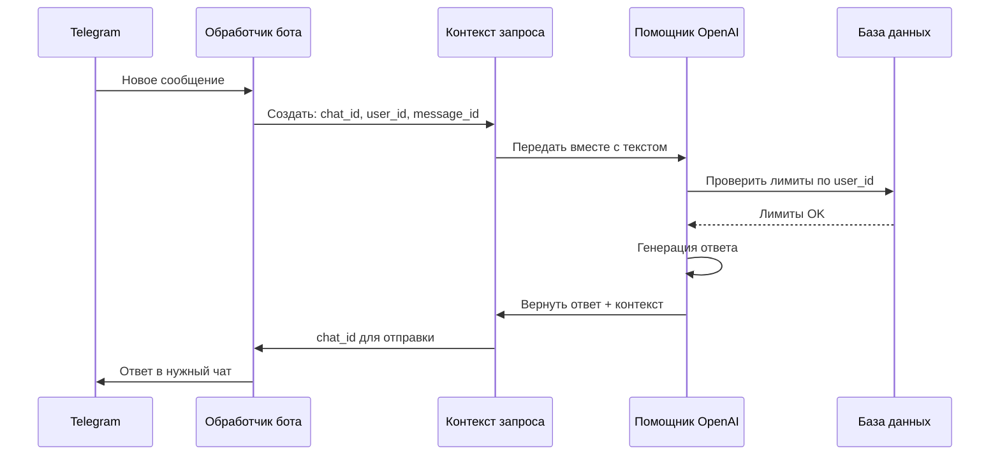

# Chapter 7: Контекст запроса

В [предыдущей главе](06_помощник_openai.md) мы узнали, как **Помощник OpenAI** выступает в роли секретаря-переводчика между Telegram и нейросетью: скачивает голосовые сообщения, расшифровывает их, отправляет в GPT и возвращает ответы. Но представьте: Мария пишет боту из личного чата, Пьер — из группового чата компании, а Алексей — из супергруппы с десятками пользователей. Как бот понимает, *кому именно* отвечать? В какой чат отправить ответ? Не перепутать ли сообщения между пользователями? Вот здесь на сцену выходит **Контекст запроса** — визитная карточка каждого сообщения, которая хранит всё необходимое для адресации.

## Зачем нужен Контекст запроса?

Представьте почтовую службу без адресов на конвертах. Письма есть, но куда их доставлять — непонятно. Или ресторан, где заказы принимают, но не записывают номер столика: кому нести борщ, а кому — салат? **Контекст запроса** — это как чек в ресторане с номером столика: он говорит системе, откуда пришёл запрос и куда нужно вернуть ответ.

### Конкретный пример

Мария пишет боту в личном чате: *«Привет, помоги с переводом»*. Одновременно в групповом чате «Команда разработки» Пьер спрашивает: *«Бот, объясни этот баг»*. А в супергруппе «Школа английского» Алексей просит: *«Произнеси это предложение»*.

Бот получает три потока сообщений одновременно. Без Контекста запроса это был бы хаос — как три телефонных звонка на один номер без определителя. Но с Контекстом бот точно знает:

| Поле | Значение | Зачем нужно |
|------|----------|-------------|
| `chat_id` | `123456789` | В какой чат отправить ответ |
| `user_id` | `987654321` | Кто автор запроса (для настроек и лимитов) |
| `message_id` | `42` | На какое сообщение отвечать (для цитирования) |

## Ключевые концепции

### Концепция 1: Идентификатор чата (`chat_id`)

Это как номер квартиры в многоквартирном доме. Telegram присваивает каждому чату уникальный номер: личные чаты имеют положительные `chat_id`, а группы и каналы — отрицательные. Бот использует этот номер, чтобы «постучать в нужную дверь».

```python
# Личный чат Марии: chat_id = 123456789
# Группа разработчиков: chat_id = -1001234567890
# Супергруппа школы: chat_id = -1009876543210
```

### Концепция 2: Идентификатор пользователя (`user_id`)

Это как паспорт человека в Telegram. В отличие от имени, которое можно менять, `user_id` остаётся неизменным. Бот использует его, чтобы подключить [Настройки пользователя](02_настройки_пользователя.md) и [Отслеживание использования](05_отслеживание_использования.md).

```python
# Мария всегда: user_id = 111111111
# Даже если сменит имя с "Мария" на "Маша_Киото_2024"
```

### Концепция 3: Идентификатор сообщения (`message_id`)

Это как номер заказа в ресторане. Когда бот отвечает с цитированием или редактирует своё предыдущее сообщение, ему нужно знать, на что именно ссылаться.

```python
# Мария отправила сообщение № 42
# Бот отвечает на него, указывая message_id = 42
# Телеграм показывает «ответ на сообщение»
```

## Как использовать Контекст запроса

Посмотрим, как бот создаёт Контекст при получении сообщения. Всё начинается в [Обработчике телеграм-бота](01_обработчик_телеграм_бота.md):

```python
from dataclasses import dataclass

@dataclass(frozen=True)
class RequestContext:
    chat_id: int      # Куда отвечать
    user_id: int      # Кто спрашивает
    message_id: int | None = None  # На что отвечать
```

Флаг `frozen=True` означает: объект создаётся один раз и не меняется. Как конверт с адресом — написал, запечатал, отправил.

### Создание Контекста из сообщения Telegram

```python
# Получаем обновление от Telegram
update = telegram.Update(...)

# Извлекаем данные
chat_id = update.message.chat.id
user_id = update.message.from_user.id
message_id = update.message.message_id

# Создаём неизменяемый Контекст
context = RequestContext(
    chat_id=chat_id,
    user_id=user_id,
    message_id=message_id
)
```

### Передача Контекста через всю систему

```python
# Контекст «путешествует» вместе с запросом

async def handle_message(update, bot):
    context = RequestContext(
        chat_id=update.message.chat.id,
        user_id=update.message.from_user.id,
        message_id=update.message.message_id
    )
    
    # Передаём в Помощник OpenAI
    response = await openai_helper.ask(
        text="Привет!",
        context=context  # ← везде с собой
    )
```

## Что происходит «под капотом»

### Путь Контекста через систему



### Дополнительные поля для расширенных сценариев

Помимо трёх основных, Контекст может нести дополнительную информацию:

```python
@dataclass(frozen=True)
class RequestContext:
    chat_id: int
    user_id: int
    message_id: int | None = None
    session_id: str | None = None      # Для длинных диалогов
    request_id: str | None = None      # Для отладки и логов
```

Поле `session_id` помогает связать несколько сообщений в один разговор — как нить Ариадны в лабиринте диалогов. Поле `request_id` — как штрих-код на посылке, чтобы отследить путь конкретного запроса.

### Специальное свойство для плагинов

```python
@property
def plugin_chat_id(self) -> int:
    return int(self.chat_id)
```

Это свойство гарантирует, что `chat_id` всегда целое число. Некоторые плагины ожидают именно `int`, а не строку — это как перевод адреса в стандартный формат для почтового отделения.

## Полный пример: от сообщения до ответа

```python
# Шаг 1: Telegram присылает обновление
update = {
    "message": {
        "chat": {"id": 123456789},
        "from": {"id": 111111111, "first_name": "Мария"},
        "message_id": 42,
        "text": "Расскажи про Киото"
    }
}
```

```python
# Шаг 2: Создаём Контекст запроса
from bot.request_context import RequestContext

context = RequestContext(
    chat_id=123456789,      # Личный чат Марии
    user_id=111111111,      # Паспорт Марии в Telegram
    message_id=42           # Ответим с цитированием
)
```

```python
# Шаг 3: Используем Контекст для адресации ответа
await bot.send_message(
    chat_id=context.chat_id,        # ← точно в нужный чат
    reply_to_message_id=context.message_id,  # ← с цитированием
    text="Киото — бывшая столица Японии..."
)
```

## Зачем это важно для всей системы

Без Контекста запроса [Помощник OpenAI](06_помощник_openai.md) не знал бы, куда отправлять ответы. [Отслеживание использования](05_отслеживание_использования.md) не смогло бы связать расходы с конкретным пользователем. [Настройки пользователя](02_настройки_пользователя.md) оказались бы бесполезными — ведь непонятно, чьи настройки загружать.

Контекст запроса — это клей, который связывает все модули воедино. Как адрес на конверте связывает отправителя, почтовую службу и получателя.

## Заключение

В этой главе мы узнали, что **Контекст запроса** — это неизменяемая «визитная карточка» каждого сообщения, содержащая три ключевых идентификатора: `chat_id` (куда отвечать), `user_id` (кто спрашивает) и `message_id` (на что отвечать). Благодаря этому простому объекту бот точно направляет ответы, подключает персональные настройки и ведёт учёт расходов — даже когда обрабатывает сотни параллельных диалогов.

Но где же бот хранит всю эту информацию между сообщениями? История чатов, настройки пользователей, логи использования — всё это нужно сохранять надёжно. В следующей главе мы заглянем в **Базу данных** — долговременную память нашего бота, где живут все разговоры и предпочтения пользователей.

Продолжим в [База данных](08_база_данных.md)!

---

Generated by MultiAgent