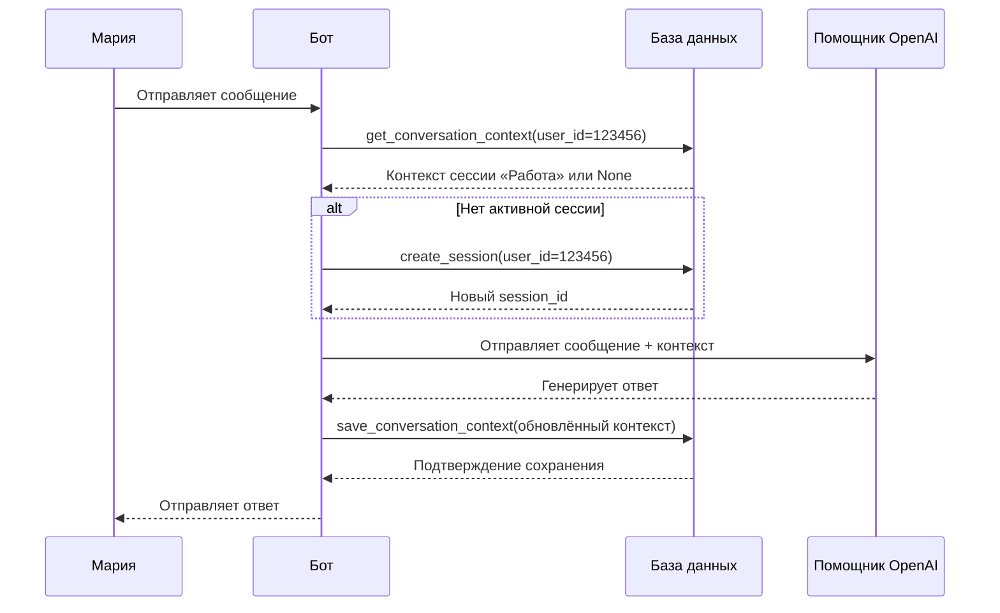

# Chapter 8: База данных

В [предыдущей главе](07_контекст_запроса.md) мы узнали, как **Контекст запроса** работает как визитная карточка каждого сообщения — хранит информацию о том, откуда пришёл запрос и куда отправить ответ. Но представьте: бот перезапустился, сервер упал, или Мария просто закрыла Telegram и открыла его через час. Где останутся её настройки, история разговора, любимый режим чата? Без постоянного хранилища всё исчезнет, как письма на доске, стёртые дождём. Вот здесь на сцену выходит **База данных** — надёжный архив, который помнит всё даже после сна.

## Зачем нужна База данных?

Представьте, что вы ведёте дневник у себя в голове. Утром вспомнили — вечером забыли. А теперь представьте **библиотеку**: каждая книга на своём месте, каждая карточка в каталоге, и даже через сто лет можно найти нужную страницу. **База данных** — это именно такая библиотека для нашего бота. Она хранит:

- Настройки каждого пользователя (язык, модель, температуру ответов)
- Историю разговоров (чтобы бот помнил, о чём шла речь вчера)
- Сессии чатов (отдельные «комнаты» для разных тем)
- Изображения и их статусы
- Служебные задачи для фоновой обработки

### Конкретный пример

Мария пользуется ботом три месяца. За это время она:
- Поменяла язык интерфейса с английского на русский
- Создала 12 сессий: «Работа», «Учёба», «Планирование отпуска»...
- Настроила температуру 0.3 для точных ответов по работе и 0.9 для творческих задач
- Сгенерировала 45 изображений

Бот перезапускается каждую ночь для обновления. Без базы данных Мария каждое утро просыпалась бы с «пустым» ботом — как первый раз. Но с **SQLite** внутри `bot/database.py` она открывает Telegram и видит: все сессии на месте, настройки сохранены, история не пропала.

## Ключевые концепции

### Концепция 1: SQLite — простая, но мощная библиотека

Представьте **коробку с картотекой**, которая живёт прямо в папке с программой. Не нужен отдельный сервер, не нужна установка — просто файл `user_data.db`. SQLite — это именно такая «коробка»: легковесная, встроенная, но при этом поддерживающая сложные запросы и множество таблиц.

```python
# bot/database.py — путь к базе данных
current_dir = os.path.dirname(os.path.abspath(__file__))
db_path = os.path.join(current_dir, 'user_data.db')
```

База создаётся автоматически при первом запуске. Всё хранится в одном файле — удобно для резервного копирования.

### Концепция 2: Потокобезопасность — когда много пользователей одновременно

Представьте **почтовое отделение** с одной кассой и очередью. Если все ломятся одновременно — хаос. В боте сотни пользователей могут писать в одно мгновение. Класс `Database` использует блокировки, чтобы каждый «клиент» обслуживался аккуратно по очереди:

```python
# Потокобезопасный доступ: каждый поток получает своё соединение
@contextmanager
def get_connection(self):
    if not hasattr(self._local, 'connection'):
        self._local.connection = sqlite3.connect(self.db_path)
    yield self._local.connection
    self._local.connection.commit()
```

Каждый поток (пользовательский запрос) получает своё личное соединение — как отдельное окошко в банке.

### Концепция 3: Таблицы — комнаты в библиотеке

Внутри базы данных информация разложена по **таблицам** — специализированным «комнатам»:

| Таблица | Что хранит | Аналогия |
|---------|-----------|----------|
| `user_settings` | Настройки пользователя | Личный шкафчик |
| `conversation_context` | История разговоров и сессии | Картотека диалогов |
| `images` | Информация об изображениях | Фотоальбом с описаниями |
| `hindsight_finalize_jobs` | Фоновые задачи обработки | Папка «Входящие» для секретаря |

```python
# Создание таблицы настроек при инициализации
cursor.execute('''
    CREATE TABLE IF NOT EXISTS user_settings (
        user_id INTEGER PRIMARY KEY,
        settings TEXT NOT NULL,
        created_at TIMESTAMP DEFAULT CURRENT_TIMESTAMP,
        updated_at TIMESTAMP DEFAULT CURRENT_TIMESTAMP
    )
''')
```

`user_id` — это как номер шкафчика: уникальный идентификатор каждого пользователя Telegram.

### Концепция 4: Сессии — отдельные «комнаты» для разных тем

Представьте, что у вас в квартире **не одна комната, а несколько**: кухня для еды, кабинет для работы, спальня для отдыха. В боте **сессии** — это такие «комнаты» для разных разговоров. В каждой своя история, свои настройки, своё название.

```python
# Создание новой сессии — как открытие новой комнаты
def create_session(self, user_id: int, session_name: str = None) -> str:
    session_id = str(uuid.uuid4())  # Уникальный номер комнаты
    
    # Деактивируем старые сессии (гасим свет в других комнатах)
    cursor.execute("""
        UPDATE conversation_context 
        SET is_active = 0 
        WHERE user_id = ?
    """, (user_id,))
    
    # Создаём новую активную сессию
    cursor.execute("""
        INSERT INTO conversation_context 
        (user_id, session_id, session_name, is_active, context)
        VALUES (?, ?, ?, 1, '{"messages": []}')
    """, (user_id, session_id, session_name or "..."))
    
    return session_id
```

Когда Мария пишет «Новый чат для планирования отпуска» — бот создаёт свежую сессию. Старые разговоры о работе не мешают, не путаются с новыми.

## Как пользоваться базой данных

### Сохранение настроек пользователя

Мария выбрала русский язык и модель `gpt-4o`. Бот запоминает это навсегда:

```python
# Сохранение: как положить вещи в шкафчик
settings = {
    "language": "ru",
    "model": "gpt-4o",
    "temperature": 0.7
}
database.save_user_settings(user_id=123456, settings=settings)
```

Происходит **волшебство «UPSERT»**: если шкафчик пуст — создаём запись, если занят — обновляем содержимое. Не нужно думать «есть ли уже настройки?»

### Получение настроек при старте

Когда Мария открывает бота, система достаёт её личные предпочтения:

```python
# Получение: как взять вещи из шкафчика
settings = database.get_user_settings(user_id=123456)
# Возвращает: {"language": "ru", "model": "gpt-4o", "temperature": 0.7}
# Или None, если Мария впервые здесь
```

Если `None` — бот показывает стандартные настройки, как «добро пожаловать в нашу библиотеку, вот вам временная карточка».

### Сохранение разговора в сессии

Мария обсуждает с ботом рецепт пасты. Каждое сообщение дописывается в историю:

```python
# Контекст разговора — как лента переписки в блокноте
context = {
    "messages": [
        {"role": "user", "content": "Как приготовить карбонару?"},
        {"role": "assistant", "content": "Возьмите спагетти, гуанчиале..."},
        {"role": "user", "content": "А можно бекон вместо гуанчиале?"}
    ]
}

database.save_conversation_context(
    user_id=123456,
    context=context,
    parse_mode="HTML",
    temperature=0.8,
    session_id="abc-123"  # Номер нашей «кухонной» комнаты
)
```

Бот теперь помнит, что речь шла о карбонаре, и ответит про бекон в контексте итальянской кухни.

### Переключение между сессиями

Мария закончила готовить и хочет обсудить проект на работе. Она выбирает сессию «Работа»:

```python
# Переключение: как войти в другую комнату
success = database.switch_active_session(
    user_id=123456,
    session_id="xyz-789"  # Номер «рабочего кабинета»
)
# Теперь все сообщения идут в рабочую сессию
```

Система автоматически «гасит свет» в кухне (деактивирует старую сессию) и «включает» в кабинете.

## Что происходит внутри: пошаговая развёртка

Представим, что Мария отправляет сообщение «Привет, помоги с переводом» после недельного перерыва. Что делает база данных?



Шаг за шагом:
1. **Запрос контекста**: бот спрашивает базу «с чем мы разговаривали?»
2. **Проверка сессии**: если Мария ушла надолго — база находит старую или создаёт новую
3. **Работа с [Помощником OpenAI](06_помощник_openai.md)**: контекст отправляется в нейросеть
4. **Сохранение результата**: новое сообщение дописывается в историю
5. **Ответ пользователю**: всё готово, разговор продолжается с того места, где остановился

## Внутреннее устройство: ключевые механизмы

### Singleton — один архив на всех

Класс `Database` построен по паттерну **Singleton** — как единственная городская библиотека, а не куча разных книжных шкафов:

```python
class Database:
    _instance = None  # Единственный экземпляр
    _lock = threading.Lock()
    
    def __new__(cls):
        with cls._lock:
            if cls._instance is None:
                cls._instance = super().__new__(cls)
                cls._instance.init_db()  # Создаём таблицы при первом разе
            return cls._instance
```

Важно: `__init__` пустой! Повторные вызовы не ломают ничего — как повторный визит в библиотеку не создаёт новую библиотеку рядом.

### Миграция: когда структура меняется

Представьте, что в библиотеке решили добавить **новые полки**, но книги уже лежат на старых. В коде есть специальная процедура миграции:

```python
def migrate_conversation_context(self):
    # Проверяем: есть ли колонка session_id?
    cursor.execute("PRAGMA table_info(conversation_context)")
    columns = [column[1] for column in cursor.fetchall()]
    
    if 'session_id' not in columns:
        # Переименовываем старую таблицу
        cursor.execute('ALTER TABLE conversation_context RENAME TO old')
        
        # Создаём новую структуру
        cursor.execute('CREATE TABLE conversation_context (...)')
        
        # Переносим данные, генерируя session_id для старых записей
        cursor.execute('''
            INSERT INTO conversation_context 
            SELECT ..., hex(randomblob(16)) as session_id, ...
            FROM old
        ''')
        
        # Удаляем старую таблицу
        cursor.execute('DROP TABLE old')
```

Это как **переезд библиотеки**: аккуратно перекладываем книги на новые полки, не потеряв ни одной.

### Автоматическое название сессии

Когда Мария создаёт сессию, но не даёт ей имя, бот умно догадывается сам:

```python
# Если название «...» — сгенерируем по первому сообщению
if session_name_current == "...":
    user_message = next(
        msg['content'] for msg in context['messages'] 
        if msg['role'] == 'user'
    )
    
    # Просим нейросеть придумать короткое название
    session_name, _ = openai_helper.ask_sync(
        f"Создай короткое название (до 20 символов) для чата: {user_message}",
        user_id,
        "Ты специалист по названиям для чатов."
    )
    session_name = session_name.strip()[:20]  # «Рецепт пасты», «Баг в API»
```

Из «...» получается «Перевод документа» или «План отпуска» — удобно потом найти в списке.

### Ограничение количества сессий

Чтобы библиотека не превратилась в свалку, есть лимит (по умолчанию 5 сессий):

```python
def delete_oldest_session(self, user_id, max_sessions=5):
    # Находим старые сессии сверх лимита
    old_ids = self.get_oldest_session_ids_for_limit(user_id, max_sessions)
    
    # Удаляем или архивируем через Hindsight
    return self.delete_sessions_by_ids(user_id, old_ids)
```

Старые диалоги уходят в архив, место освобождается для новых — как в реальной библиотеке, где редкие книги отправляются в хранилище.

## Заключение

В этой главе мы открыли двери в **библиотеку бота** — его базу данных SQLite. Узнали, как:

- Хранить настройки пользователей между перезапусками
- Организовывать разговоры в отдельные **сессии** — «комнаты» для разных тем
- Безопасно работать с множеством пользователей одновременно
- Мигрировать данные при обновлениях структуры
- Автоматически называть сессии и ограничивать их количество

База данных — это **память бота**. Без неё он был бы как золотая рыбка: всё забывает каждые три секунды. С ней — как надёжный архиварий, который помнит каждую деталь ваших разговоров.

Но хранение — это только половина дела. Как сделать так, чтобы бот не просто помнил, а **умел новые трюки**? Подключал внешние сервисы, расширял возможности без переписывания кода? В следующей главе мы познакомимся с [Менеджером плагинов](09_менеджер_плагинов.md) — системой, которая превращает бота из монолита в гибкую платформу, к которой можно прикручивать новые способности, как LEGO-кубики.

---

Generated by MultiAgent