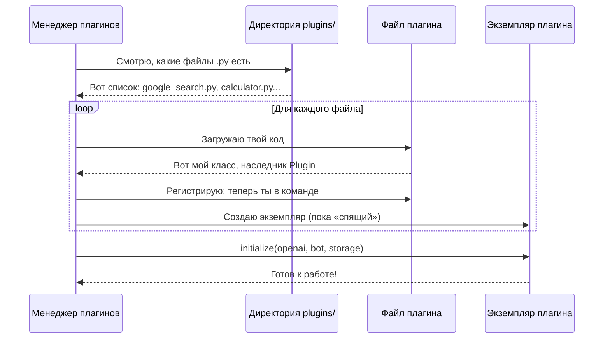
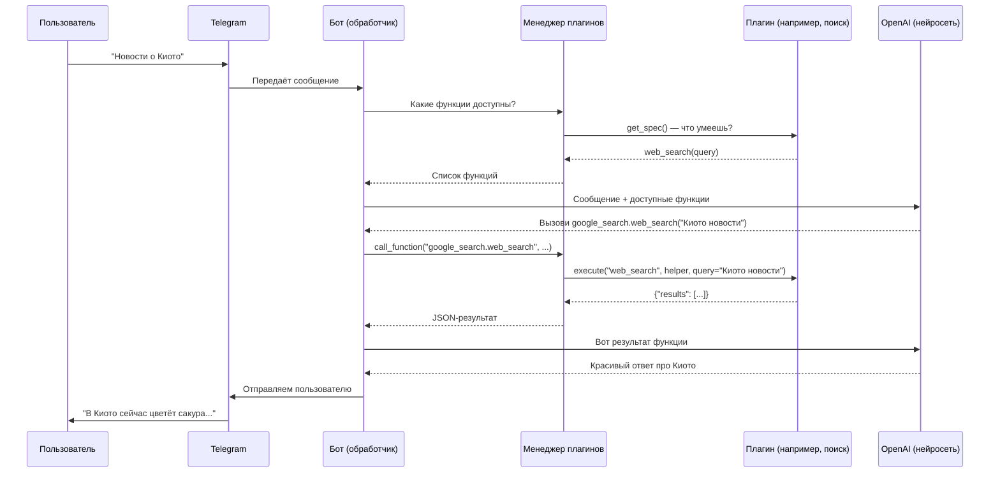

# Chapter 9: Менеджер плагинов

В [предыдущей главе](08_база_данных.md) мы узнали, как **База данных** работает как надёжная библиотека для нашего бота — хранит настройки, историю разговоров и сессии даже после перезапуска. Но представьте: вы купили новый смартфон, а в нём уже зашиты все программы навсегда — нельзя установить карту города, новый мессенджер или игру. Скучно и неудобно, правда? Точно так же бот, у которого весь функционал «зашит» в коде, быстро становится тяжёлым и неповоротливым. Вот здесь на сцену выходит **Менеджер плагинов** — волшебный конструктор, который позволяет добавлять новые способности боту «на лету», без переписывания всей программы.

## Зачем нужен Менеджер плагинов?

Представьте, что ваш бот — это кухонный комбайн. Сначала он умеет только резать овощи. Но вам захотелось взбивать супы, месить тесто, давить сок. Покупать каждый раз новый комбайн? Дорого и глупо. Гораздо умнее — купить **насадки**: одну для супа, другую для теста, третью для сока. Щёлк — и комбайн превратился в соковыжималку. Щёлк — и снова в нарезалку.

**Менеджер плагинов** — это именно такая система «насадок» для бота. Он позволяет:

- Добавлять новые функции без изменения основного кода
- Включать и выключать возможности по желанию
- Разрабатывать расширения отдельно, как самостоятельные мини-программы

### Конкретный пример

Мария пользуется ботом для работы. Сначала ему хватает базовых способностей — отвечать на вопросы и вести диалог. Но потом ей понадобилось:
1. **Искать в интернете** — для проверки актуальных новостей
2. **Выполнять код** — для быстрых расчётов
3. **Работать с терминалом** — для управления сервером

Без плагинов разработчикам пришлось бы влезать в «сердце» бота и аккуратно пришивать каждую новую функцию — рискуя сломать всё остальное. С Менеджером плагинов каждая возможность живёт в **отдельном файле**, который можно просто положить в папку — и бот сам его найдёт, поймёт и подключит.

## Как устроен плагин?

Прежде чем разбирать Менеджер, нужно понять, что такое **плагин** с точки зрения кода. Это как договорённость между ботом и новой «насадкой»: если насадка сделана по правилам, комбайн поймёт, как ею пользоваться.

### Базовый класс плагина

Все плагины наследуются от абстрактного класса `Plugin`. Это как шаблон резюме: все заполняют одни и те же графы, но содержимое разное.

```python
# bot/plugins/plugin.py — шаблон для всех плагинов
from abc import abstractmethod, ABC

class Plugin(ABC):
    # У каждого плагина есть «удостоверение личности»
    plugin_id: str | None = None
    
    def initialize(self, openai=None, bot=None, storage_root=None):
        """Бот вызывает этот метод, когда «вставляет» плагин"""
        self.openai = openai      # доступ к нейросети
        self.bot = bot            # доступ к Telegram
        self.storage_root = storage_root  # папка для данных
    
    @abstractmethod
    def get_source_name(self) -> str:
        """Как плагин представляется: «Я — поисковик Google»"""
        pass
    
    @abstractmethod
    def get_spec(self) -> list[dict]:
        """Что умеет делать: список функций с описанием"""
        pass
    
    @abstractmethod
    async def execute(self, function_name, helper, **kwargs):
        """Собственно выполнение: «Наши новости о Киото»"""
        pass
```

Ключевые моменты:
- `get_spec()` — это как **меню ресторана**: перечисляет блюда (функции) и их состав (параметры)
- `execute()` — это **кухня**: готовит заказанное блюдо
- `initialize()` — **приём на работу**: бот даёт плагину доступ к нужным инструментам

## Жизненный цикл плагина

Когда бот запускается, Менеджер плагинов проходит через несколько этапов. Представьте, что это приём нового сотрудника в компанию:



## Менеджер плагинов изнутри

Теперь посмотрим, как это реализовано в коде. Начнём с самого сердца — метода `load_plugins()`, который «обходит» папку с плагинами.

### Шаг 1: Поиск и фильтрация файлов

```python
# bot/plugin_manager.py — начало загрузки
def load_plugins(self):
    self.plugins.clear()           # чистим старый список
    self.plugin_instances.clear()  # и старые «живые» копии
    
    excluded = {'__init__.py', 'plugin.py'}  # служебные файлы
    
    for file in sorted(self.plugins_directory.glob("*.py")):
        if file.name in excluded:
            continue               # пропускаем шаблоны
        
        name = file.stem           # "google_search" без .py
        # Проверяем: разрешён ли этот плагин в настройках?
        if self.enabled_plugins and name not in self.enabled_plugins:
            continue               # пропускаем выключенные
        
        module = self.load_plugin_module(name)
        if module:
            self.register_plugin(name, module)
```

Здесь важно: `enabled_plugins` — это список из конфигурации. Можно включить только нужное, а остальное игнорировать.

### Шаг 2: Загрузка модуля «вручную»

Python обычно импортирует модули через `import`, но плагины лежат в особой папке. Менеджер использует `importlib` — инструмент для **динамической** загрузки:

```python
def load_plugin_module(self, plugin_name):
    try:
        path = self.plugins_directory / f"{plugin_name}.py"
        
        # Создаём «спецификацию» загрузки
        spec = importlib.util.spec_from_file_location(
            'bot.plugins.' + plugin_name,  # виртуальный путь
            path                             # реальный файл
        )
        module = importlib.util.module_from_spec(spec)
        spec.loader.exec_module(module)      # выполняем код файла
        
        return module
    except Exception as e:
        logger.info(f"Ошибка загрузки {plugin_name}: {e}")
        return None
```

Это как если бы вы вместо покупки книги в магазине взяли рукопись из ящика стола и аккуратно переплели её в библиотечный фонд.

### Шаг 3: Регистрация — поиск класса-плагина

Файл загружен, но в нём может быть много классов. Какой именно — плагин?

```python
def register_plugin(self, name, module):
    # Ищем все классы, которые «родом из» Plugin
    plugin_classes = [
        cls for name, cls in inspect.getmembers(module, inspect.isclass)
        if issubclass(cls, Plugin) and cls != Plugin  # не сам шаблон!
    ]
    
    if not plugin_classes:
        logger.warning(f"В {name} нет класса-плагина")
        return
    
    # Берём первый подходящий, запоминаем
    self.plugins[name] = plugin_classes[0]
    logger.info(f"Плагин зарегистрирован: {name}")
```

### Шаг 4: Создание «живого» экземпляра

Класс зарегистрирован, но это лишь чертёж. Нужен **объект** — конкретный рабочий экземпляр:

```python
def get_plugin(self, plugin_name):
    # Проверяем кеш: может, уже создавали?
    if plugin_name in self.plugin_instances:
        instance = self.plugin_instances[plugin_name]
        # Проверим, инициализирован ли
        if not hasattr(instance, 'openai') or not instance.openai:
            instance.initialize(openai=self.openai, ...)
        return instance
    
    # Создаём впервые
    plugin_class = self.plugins.get(plugin_name)
    if plugin_class:
        instance = plugin_class()      # вызываем «конструктор»
        instance.plugin_id = plugin_name
        instance.function_prefix = plugin_name
        
        if self.openai:                # даём доступ к инструментам
            instance.initialize(...)
        
        self.plugin_instances[plugin_name] = instance
        return instance
    return None
```

Обратите внимание на **кеширование**: один плагин = один экземпляр. Не создаём тысячу калькуляторов, когда достаточно одного.

## Как плагин становится доступен нейросети?

Вот где происходит магия. Мы знаем из [главы про Помощник OpenAI](06_помощник_openai.md), что нейросеть может вызывать **функции** (tools). Менеджер плагинов превращает способности плагинов в такие функции.

### Получение «меню» функций

```python
def get_functions_specs(self, helper, model_to_use, allowed_plugins=None):
    # Ничего не разрешено? Возвращаем пустой список
    if not allowed_plugins or allowed_plugins == ['None']:
        return []
    
    all_specs = []
    seen_functions = set()
    
    for name, plugin_class in self.plugins.items():
        # Фильтр: разрешён ли конкретно этот плагин?
        if allowed_plugins != ['All'] and name not in allowed_plugins:
            continue
        
        instance = self.get_plugin(name)
        if not instance:
            continue
        
        # Получаем «меню» от плагина и нормализуем имена
        specs = self._normalize_specs(instance.get_spec(), instance)
        
        for spec in specs:
            func_name = spec.get('name')
            if func_name not in seen_functions:
                seen_functions.add(func_name)
                all_specs.append(spec)
            else:
                logger.warning(f"Дубликат функции: {func_name}")
    
    # Формат зависит от модели: OpenAI или Google
    if model_to_use in GOOGLE_MODELS:
        return {"function_declarations": all_specs}
    return [{"type": "function", "function": s} for s in all_specs]
```

Метод `_normalize_specs` добавляет **префикс** к именам функций, чтобы не было путаницы:

```python
def _normalize_specs(self, specs, plugin_instance):
    prefix = plugin_instance.get_function_prefix()  # например, "google_search"
    result = []
    for spec in specs:
        name = spec["name"]
        if "." not in name:           # если нет префикса — добавляем
            spec = dict(spec)
            spec["name"] = f"{prefix}.{name}"  # "google_search.web_search"
        result.append(spec)
    return result
```

Так функция `web_search` из плагина `google_search` становится `google_search.web_search` — уникальной и неперепутываемой.

## Вызов функции: от нейросети к плагину

Когда нейросеть решает вызвать функцию, Помощник OpenAI передаёт имя и аргументы Менеджеру плагинов. Тот находет нужный плагин и выполняет:

```python
async def call_function(self, function_name, helper, arguments, request_context=None):
    # 1. Находим плагин по имени функции
    plugin = self.__get_plugin_by_function_name(function_name)
    if not plugin:
        return json.dumps({'error': f'Функция {function_name} не найдена'})
    
    try:
        # 2. Разбираем аргументы из JSON
        parsed_args = json.loads(arguments)
        
        # 3. Проверяем аргументы по спецификации (валидация)
        spec = self.get_spec_by_function_name(function_name)
        if spec:
            errors = validate_function_args(spec, parsed_args)
            if errors:
                return json.dumps({'error': f'Неверные аргументы: {errors}'})
        
        # 4. Добавляем контекст запроса (из главы 7)
        if request_context is not None:
            parsed_args['request_context'] = request_context
        
        # 5. Вызываем! Отрезаем префикс, передаём в плагин
        base_name = function_name.split(".", 1)[-1]  # "web_search"
        result = await plugin.execute(base_name, helper, **parsed_args)
        
        return json.dumps(result, default=str)
        
    except Exception as e:
        return json.dumps({'error': str(e)})
```

## Плагины как команды Telegram

Плагины могут добавлять не только функции для нейросети, но и **команды** — кнопки в меню бота. Пользователь пишет `/погода Москва`, и плагин отвечает напрямую, без участия ИИ.

```python
# Пример: что возвращает плагин для регистрации команд
def get_commands(self):
    return [{
        "command": "weather",           # имя без /
        "description": "Прогноз погоды",  # в меню Telegram
        "handler": self.weather_handler,  # функция-обработчик
        "add_to_menu": True,             # показывать в меню?
    }]
```

Менеджер собирает команды всех плагинов, проверяет уникальность и строит меню:

```python
def build_bot_commands(self):
    plugin_commands = self.get_plugin_commands()
    menu_entries = []
    
    for cmd in plugin_commands:
        if cmd.get("add_to_menu"):
            menu_entries.append({
                "command": cmd["command"],
                "description": cmd["description"],
            })
    
    return {
        "plugin_commands": plugin_commands,  # для обработчиков
        "menu_entries": menu_entries          # для меню Telegram
    }
```

## Полная картина: диаграмма взаимодействия



## Проверка и защита

Менеджер плагинов заботится о том, чтобы ничего не сломалось:

```python
def _validate_enabled_plugins(self):
    # Проверяем: все ли включённые плагины загрузились?
    missing = [p for p in self.enabled_plugins if p not in self.plugins]
    
    if missing:
        # Ищем похожие названия — может, опечатка?
        available = self._get_available_plugin_files()
        suggestions = {
            name: difflib.get_close_matches(name, available, n=3)
            for name in missing
        }
        logger.error(f"Не найдены плагины: {missing}. Похожие: {suggestions}")
```

Это как если бы секретарь, не найдя сотрудника в штатном расписании, предложил: «Может, вы имели в виду Иванова, а не Иваннова?»

## Заключение

В этой главе мы разобрали, как **Менеджер плагинов** превращает бот из монолита в гибкую модульную систему:

- **Плагины** — самостоятельные «насадки» с чётким контрактом (класс `Plugin`)
- **Динамическая загрузка** — плагины подхватываются из папки без перезаписи основного кода
- **Кеширование экземпляров** — один плагин = один живой объект
- **Нормализация имён** — префиксы предотвращают конфликты функций
- **Валидация** — проверка аргументов и диагностика ошибок

Мы увидели, как Менеджер связывает воедино [Помощник OpenAI](06_помощник_openai.md) (нейросеть), [Контекст запроса](07_контекст_запроса.md) (откуда пришёл запрос) и сами плагины (что умеют делать). Без этой связующей прослойки каждый плагин пришлось бы встраивать в бота вручную — долго, опасно и неудобно.

Но плагины — это лишь половина истории. Как именно нейросеть *решает*, какую функцию вызвать? Как происходит «разговор» между ИИ и инструментами? В следующей главе мы заглянем в саму механику этих вызовов и познакомимся с **[Обработчиком инструментов](10_обработчик_инструментов.md)** — тем, кто переводит «желания» нейросети в конкретные действия.

---

Generated by MultiAgent