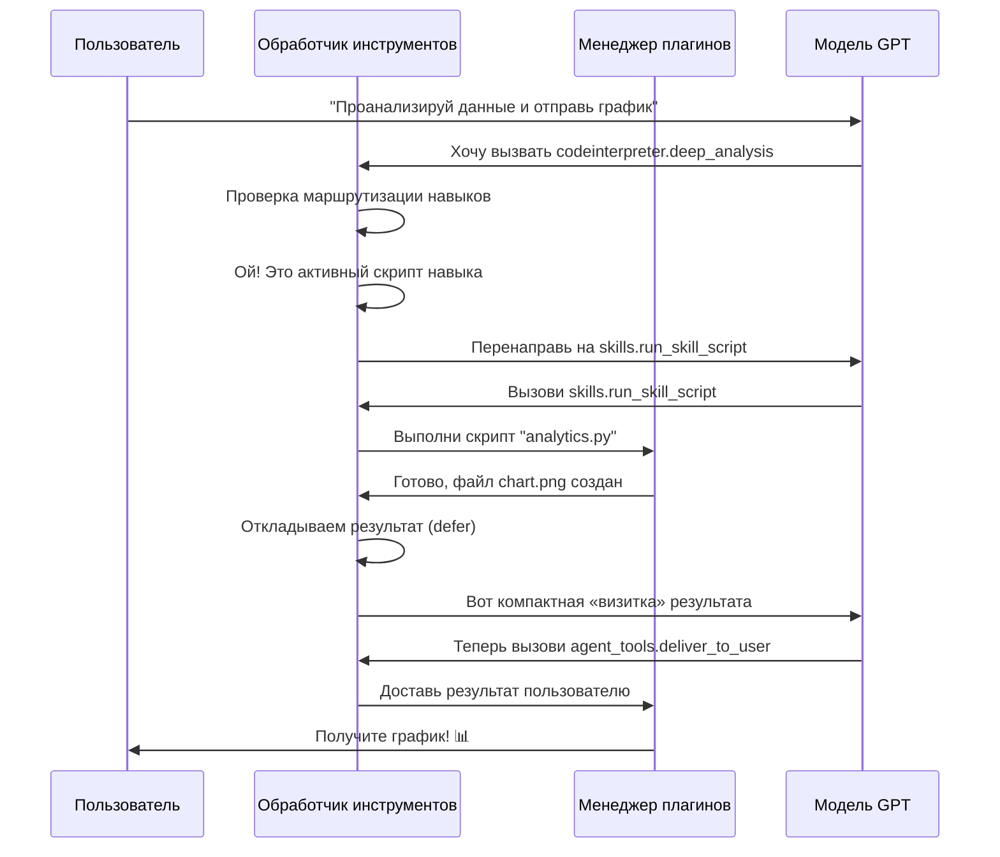

# Chapter 10: Обработчик инструментов

В [предыдущей главе](09_менеджер_плагинов.md) мы узнали, как **Менеджер плагинов** работает как волшебный конструктор — позволяет добавлять боту новые «насадки» без переписывания всей программы. Но представьте: бот подключил десяток плагинов — веб-поиск, калькулятор, генератор изображений, терминал... Модель GPT решает: *«Нужно найти погоду и посчитать валюту»*. Как понять, какой плагин за что отвечает? Как передать ему правильные параметры? Как собрать ответы воедино? Вот здесь на сцену выходит **Обработчик инструментов** — диспетчер, который маршрутизирует вызовы функций между агентом и внешними инструментами.

## Зачем нужен Обработчик инструментов?

Представьте, что вы звоните в колл-центр крупной компании. Автоответчик говорит: *«Нажмите 1 для бухгалтерии, 2 для технической поддержки, 3 для отдела продаж»*. Без такого меню хаос — ваш звонок блуждал бы по коридорам, а сотрудники не знали бы, чем вам помочь.

**Обработчик инструментов** — это именно такой интеллектуальный автоответчик для нашего бота. Он:

- Распознаёт, какие инструменты хочет вызвать модель
- Проверяет права доступа (разрешён ли плагин в текущем режиме)
- Передаёт параметры нужному плагину
- Собирает результаты и возвращает их модели для финального ответа

### Конкретный пример

Мария спрашивает бота в режиме агента навыков: *«Проанализируй данные из файла sales.csv с помощью скрипта аналитики и отправь мне график»*.

Без Обработчика инструментов это был бы хаос — модель могла бы:
- Попытаться выполнить скрипт напрямую (нарушив безопасность)
- Забыть про финальную доставку результата
- Перепутать параметры между плагинами

С Обработчиком инструментов всё проходит по протоколу:

| Шаг | Что происходит | Результат |
|:---|:---|:---|
| 1 | Модель запрашивает `codeinterpreter.deep_analysis` | Обработчик проверяет — а не навык ли это? |
| 2 | Обнаружено: скрипт принадлежит активному навыку | Перенаправление на `skills.run_skill_script` |
| 3 | Скрипт выполняется, создаёт график | Результат откладывается (`defer`) |
| 4 | Модель вызывает `agent_tools.deliver_to_user` | Обработчик доставляет график Марии |

## Ключевые концепции

### Концепция 1: Потоковая и обычная обработка

Обработчик работает в двух режимах — как прямой эфир и как запись:

```python
# Потоковый режим: ответ приходит кусочками, как радиопередача
async for item in response:
    # Собираем части вызова инструмента по капле
    if item.choices[0].delta.tool_calls:
        # Накапливаем имя функции и аргументы
        tool_call_parts[idx]["name"] += tc.function.name
```

**Потоковый режим** — как прослушивание радио: данные приходят частями, и мы собираем их «в прямом эфире». Полезно, когда ответ большой и пользователь не должен ждать.

```python
# Обычный режим: ответ приходит целиком, как письмо в конверте
if response.choices[0].message.tool_calls:
    for tc in response.choices[0].message.tool_calls:
        # Сразу видим полный вызов
        tool_calls.append({
            "name": tc.function.name,
            "arguments": tc.function.arguments,
        })
```

**Обычный режим** — как получение письма: всё содержимое уже внутри, можно сразу обработать.

### Концепция 2: Контракт доставки

В режиме агента навыков модель обязана передать финальный результат через специальный инструмент — `agent_tools.deliver_to_user`. Это как правило протокола в посольстве: *«Документы только через установленный канал»*.

```python
DELIVERY_TOOL_NAME = "agent_tools.deliver_to_user"
DELIVERY_REPAIR_PROMPT = (
    "Нарушение протокола: этот режим чата требует, "
    "чтобы финальный ответ был отправлен через agent_tools.deliver_to_user. "
    "Не отвечай обычным текстом. Вызови agent_tools.deliver_to_user сейчас."
)
```

Если модель «забывает» про протокол, Обработчик автоматически напоминает — как дипломат, который поправляет коллегу: *«Простите, но по регламенту нужно вот так»*.

### Концепция 3: Отложенные результаты

Иногда инструмент создаёт большой файл или изображение — нечто, что нельзя впихнуть в историю чата (займёт тысячи токенов). Тогда Обработчик **откладывает** (`defer`) результат:

```python
def _compact_deferred_tool_response(response) -> str:
    # Вместо полного файла сохраняем «визитку»
    compact = {
        "result": "deferred",  # Результат отложен
        "text_chars": 15420,   # Сколько символов
        "text_preview": "Первые 600 символов...",  # Пробник
        "artifact_paths": ["/tmp/chart.png"],  # Где лежит файл
    }
    return json.dumps(compact)
```

Это как в библиотеке: вместо того чтобы таскать тяжёлый том в читальный зал, вы берёте карточку — а книгу заказываете отдельно.

## Внутреннее устройство: пошаговый разбор

### Диаграмма потока вызова



### Шаг 1: Распознавание вызовов

Когда приходит ответ от модели, Обработчик первым делом смотрит: а не прячутся ли там вызовы инструментов?

```python
# Для потокового режима — собираем по частям
tool_call_parts = {}
async for item in response:
    if item.choices[0].delta.tool_calls:
        for tc in item.choices[0].delta.tool_calls:
            idx = tc.index  # Номер вызова
            # Накапливаем как пазл
            tool_call_parts[idx]["name"] += tc.function.name
            tool_call_parts[idx]["arguments"] += tc.function.arguments
```

Это как сборка сообщения из кусочков бумаги, приходящих по факсу.

### Шаг 2: Проверка прав и маршрутизация

Перед выполнением Обработчик спрашивает [Менеджер плагинов](09_менеджер_плагинов.md): *«А разрешён ли этот плагин сейчас?»*

```python
# Проверяем, можно ли использовать инструмент
if not helper.plugin_manager.is_function_allowed(tool_name, allowed_plugins):
    error = f'Инструмент {tool_name} не разрешён в текущем режиме чата'
    # Отказываем вежливо, как охранник без пропуска
    errors.append((tool_name, tool_call_id, json.dumps({'error': error})))
    continue
```

Затем проверяется специальная маршрутизация навыков — чтобы скрипты активных навыков выполнялись правильным путём:

```python
# Проверяем, не нужно ли перенаправить на навык
routing_error = _skill_script_routing_error(helper, chat_id, tool_name, args)
if routing_error:
    # Например: "Этот скрипт принадлежит навыку, используй skills.run_skill_script"
    errors.append((tool_name, tool_call_id, json.dumps(routing_error)))
    continue
```

### Шаг 3: Выполнение и сбор результатов

Все разрешённые вызовы запускаются параллельно — как несколько кассиров, обслуживающих очередь одновременно:

```python
# Создаём задачи для параллельного выполнения
tasks = [
    helper.plugin_manager.call_function(name, helper, args, request_context)
    for name, args, _ in prepared
]
# Ждём все результаты одновременно
results = await asyncio.gather(*tasks, return_exceptions=True)
```

### Шаг 4: Обработка прямых результатов

Некоторые инструменты возвращают «прямой результат» — файл, фото, текст, который нужно сразу отправить пользователю:

```python
# Проверяем, нужно ли отложить результат
if is_direct_result(tool_response):
    if not _should_defer_direct_result(tool_response, defer_direct_results):
        # Сразу отправляем пользователю
        direct_results_collected.append(tool_response)
        # В историю пишем «уже отправлено»
        add_tool_result(tool_name, '{"result": "Done, sent to user"}')
    else:
        # Откладываем — слишком большой для истории
        add_tool_result(tool_name, _compact_deferred_tool_response(tool_response))
```

### Шаг 5: Рекурсивный возврат к модели

Если были вызваны инструменты (а не просто доставлен результат), Обработчик отправляет результаты обратно модели — и процесс может повториться:

```python
# Отправляем результаты инструментов обратно в GPT
response = await helper.client.chat.completions.create(
    model=model_to_use,
    messages=await helper._apply_before_chat_request_mutators(
        chat_id,
        request_id=request_id,
        user_id=user_id,
        persist=False,
    ),
    tools=tools,
    # Ограничиваем цикл: не более N вызовов подряд
    tool_choice='auto' if times < max_calls else 'none',
    stream=stream,
)
# Рекурсивно обрабатываем — модель может захотеть ещё инструменты
return await handle_function_call(helper, chat_id, response, ...)
```

Это как диалог с экспертом: вы спрашиваете, он просит уточнить данные, вы предоставляете, он анализирует — и так до финального ответа.

## Система маршрутизации навыков в деталях

Файл `bot/skill_script_routing.py` отвечает за важную задачу: не дать модели «обмануть» систему и выполнить скрипт навыка неправильным путём.

```python
# Регулярное выражение: ищет пути к скриптам навыков
SKILL_SCRIPT_PATH_RE = re.compile(
    r"skills[/\\][^\s'\"`/\\]+[/\\]scripts[/\\][^\s'\"`]+",
    re.IGNORECASE,
)
```

Когда модель пытается вызвать `codeinterpreter.deep_analysis` с кодом, содержащим путь к скрипту навыка, система перехватывает:

```python
def _skill_script_routing_error(helper, chat_id, tool_name, tool_args):
    # Проверяем только codeinterpreter.deep_analysis
    if tool_name != "codeinterpreter.deep_analysis":
        return None  # Другие инструменты не проверяем
    
    # Собираем текст для анализа
    text = "\n".join(str(tool_args.get(f) or "") for f in ("code_prompt", "data_path"))
    
    # Есть активные скрипты навыков?
    active_scripts = _active_skill_scripts(helper, tool_args)
    if active_scripts and _refers_to_active_script(text, active_scripts):
        # Запрещаем! Нужно использовать skills.run_skill_script
        return {
            "error": "Перенаправление запрещено...",
            "preferred_tool": "skills.run_skill_script",
        }
```

Это как система безопасности аэропорта: пассажиры с обычными билетами проходят, но если кто-то пытается пронести «запрещённый груз» — срабатывает проверка.

## Заключение

В этой главе мы узнали, как **Обработчик инструментов** работает как диспетчер колл-центра — принимает запросы от модели, проверяет права, маршрутизирует к нужным плагинам и собирает результаты. Мы разобрали:

- **Потоковую и обычную обработку** — как радио и письмо
- **Контракт доставки** — строгий протокол для режима агента навыков
- **Отложенные результаты** — «визитки» вместо тяжёлых файлов в истории
- **Маршрутизацию навыков** — защиту от неправильного выполнения скриптов

Обработчик тесно работает с [Менеджером плагинов](09_менеджер_плагинов.md) для проверки прав и вызова функций, а также использует [Контекст запроса](07_контекст_запроса.md) для правильной адресации. Но самые интересные инструменты, которые он маршрутизирует, мы ещё не рассмотрели. Что именно умеют эти плагины? Какие «насадки» доступны нашему боту?

В [следующей главе](11_инструменты_агента.md) мы заглянем в арсенал **Инструментов агента** — конкретных способностей, которые Обработчик доставляет пользователям. Увидим, как бот ищет в интернете, выполняет код, работает с терминалом и многое другое!

---

Generated by MultiAgent
