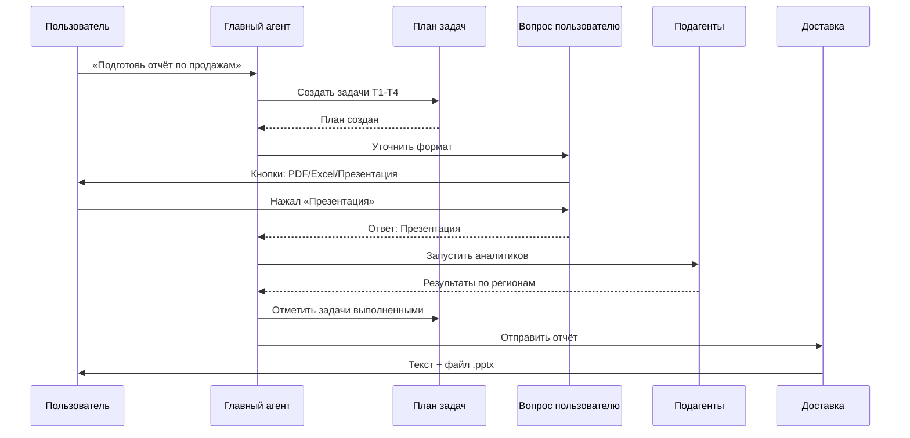

# Chapter 11: Инструменты агента

В [предыдущей главе](10_обработчик_инструментов.md) мы узнали, как **Обработчик инструментов** работает как диспетчер колл-центра — маршрутизирует вызовы функций между агентом и плагинами. Но представьте: бот получил сложную задачу — *«Составь план отпуска, уточни у меня даты, найди отели, сделай презентацию и отправь мне»*. Как агенту не заблудиться в этом лабиринте шагов? Как задать уточняющий вопрос? Как доставить результат? Вот здесь на сцену выходят **Инструменты агента** — набор вспомогательных инструментов, которые помогают агенту планировать, общаться с пользователем и доставлять результаты.

## Зачем нужны Инструменты агента?

Представьте, что вы — шеф-повар в ресторане. К вам приходит заказ на семейный ужин: суп, горячее, десерт, всё с учётом аллергий. Вы не бросаетесь сразу жарить всё на одной сковороде! Вы:
1. **Планируете** — записываете список блюд и порядок приготовления
2. **Уточняете** — выходите в зал и спрашиваете: *«Аллергия на орехи — это все орехи или только грецкие?»*
3. **Готовите по частям** — поручаете помощникам готовить разные блюда параллельно
4. **Собираете и подаёте** — аккуратно расставляете всё на поднос и выносите гостю

**Инструменты агента** — это именно такой «кухонный органайзер» для нашего бота. Они позволяют:
- **Планировать задачи** — вести список шагов и отмечать выполненное
- **Задавать вопросы пользователю** — прямо в Telegram, с кнопками или свободным текстом
- **Запускать подагентов** — поручать части работы параллельно
- **Доставлять результаты** — красиво отправлять финальный ответ с файлами

### Конкретный пример

Мария пишет боту: *«Подготовь отчёт по продажам за квартал»*. Бот в режиме агента решает:

1. Создаёт **план задач**: T1 — загрузить данные, T2 — проанализировать, T3 — сделать график, T4 — отправить отчёт
2. **Спрашивает уточнение**: *«Какой формат отчёта?»* — с кнопками «PDF», «Excel», «Презентация»
3. Запускает **подагента** для параллельного анализа трендов по регионам
4. **Доставляет результат**: текстовое резюме + файл презентации

Без Инструментов агента бот либо сделал бы всё за один шаг (и накосячил), либо забыл бы про половину задачи.

---

## Ключевые концепции

### 1. Управление планом задач (`manage_plan_tasks`)

Представьте доску с липкими стикерами в офисе. На каждом стикере — задача, и она может быть: 🟡 в ожидании, 🔵 в работе, ✅ выполнена или ❌ отменена. Только одна задача может быть «в работе» одновременно, и нельзя начинать новую, пока старая не закрыта.

```python
# Пример вызова инструмента планирования
{
    "action": "add",
    "tasks": [
        {"id": "T1", "content": "Загрузить данные из CRM", "status": "pending"},
        {"id": "T2", "content": "Построить график продаж", "status": "pending"}
    ]
}
```

Ответ показывает текущий план и прогресс: сколько всего задач, сколько закрыто, сколько открыто.

### 2. Вопрос пользователю (`ask_telegram_user`)

Представьте диалоговое окно в приложении с вариантами ответа. Бот может задать вопрос и предложить кнопки — пользователь нажимает, и ответ мгновенно возвращается агенту. Можно разрешить свободный текст или даже множественный выбор (галочки + кнопка «Подтвердить»).

```python
# Бот спрашивает формат отчёта
{
    "question": "В каком формате прислать отчёт?",
    "options": ["PDF", "Excel", "Презентация"],
    "allow_free_text": False,
    "timeout_seconds": 300
}
```

Пользователь видит сообщение с тремя кнопками. Нажимает «Презентация» — и бот продолжает работу с этим выбором.

### 3. Доставка результатов (`deliver_to_user`)

Это финальная точка — как вручение заказа на кассе. Бот отправляет текст и/или файлы пользователю, и цикл агента завершается. Важно: вызвать можно только один раз, иначе дубликаты подавляются автоматически.

```python
# Финальная доставка отчёта
{
    "text": "Отчёт готов! Краткое резюме: продажи выросли на 15%.",
    "artifacts": [
        {"file_path": "/tmp/quarterly_report.pptx", "caption": "Отчёт за квартал"}
    ]
}
```

### 4. Подагенты (`run_subagents`)

Представьте бригаду стажёров, которым вы поручаете мелкие поручения. Каждый стажёр работает самостоятельно, но не может напрямую разговаривать с клиентом — только вернуть вам результаты. Подагенты запускаются параллельно и ускоряют сложные задачи.

```python
# Запуск двух подагентов параллельно
{
    "subagents": [
        {
            "id": "analyst_north",
            "role": "Аналитик по северу",
            "task": "Проанализировать продажи в северных регионах"
        },
        {
            "id": "analyst_south", 
            "role": "Аналитик по югу",
            "task": "Проанализировать продажи в южных регионах"
        }
    ],
    "shared_context": "Анализ за Q3 2024, валюта — рубли"
}
```

---

## Как это работает изнутри

### Жизненный цикл запроса



### Где живёт код

Все инструменты реализованы в одном файле: [`bot/plugins/agent_tools.py`](bot/plugins/agent_tools.py). Это плагин, который регистрируется в [Менеджере плагинов](09_менеджер_плагинов.md) и вызывается через [Обработчик инструментов](10_обработчик_инструментов.md).

#### Инициализация и хранение данных

```python
class AgentToolsPlugin(Plugin):
    plugin_id = "agent_tools"
    
    def __init__(self):
        self.tasks = {}           # Планы задач по чатам
        self.pending_questions = {}  # Ожидающие вопросы
        self._recent_deliveries = {} # Защита от дубликатов
```

Планы задач сохраняются в JSON-файл, чтобы пережить перезапуск бота. Вопросы тоже сериализуются — если бот упал во время ожидания ответа, при перезапуске он очистит «осиротевшие» кнопки и уведомит пользователя.

#### Спецификация инструментов для модели

```python
def get_spec(self) -> List[Dict]:
    return [
        {
            "name": "manage_plan_tasks",
            "description": "Управление планом задач...",
            # ...параметры action, tasks и т.д.
        },
        # ...ask_telegram_user, deliver_to_user, run_subagents
    ]
```

Модель GPT «видит» эти описания и решает, какой инструмент вызвать. Каждый инструмент — это «глагол», который агент может использовать в своём рассуждении.

#### Валидация плана задач

```python
def _validate_plan_tasks(self, tasks):
    # Только одна задача "в работе"
    # Нельзя начинать новую, пока старая открыта
    # Не более одной открытой задачи доставки
```

Эти правила защищают от хаоса: агент не может случайно запустить всё одновременно или создать десять одинаковых задач «отправить файл».

#### Защита доставки от дубликатов

```python
# Ключ дедупликации по ID запроса или сообщения
dedup_key = f"request:{request_id}"
# Или: f"message:{chat_id}:{message_id}"

# Повторный вызов в течение 60 секунд подавляется
if (now - last_delivery) < 60:
    return {"skipped": True, "reason": "Уже доставлено"}
```

Это как штамп «Оплачено» на чеке — второй раз пробить кассу не даст.

#### Подагенты и их ограничения

```python
SUBAGENT_BLOCKED_FUNCTIONS = {
    "agent_tools.ask_telegram_user",      # Нельзя спрашивать пользователя
    "agent_tools.deliver_to_user",        # Нельзя доставлять напрямую
    "agent_tools.run_subagents",          # Нельзя запускать вложенных
}
```

Подагенты работают в «песочнице»: они могут использовать инструменты и навыки, но финальное решение остаётся за главным агентом. Системный промпт для подагентов загружается из файла [`bot/prompts/subagent_system.md`](bot/prompts/subagent_system.md):

> *«Ты ограниченный подагент. Не обращайся к пользователю, не задавай вопросов. Не публикуй артефакты напрямую — родительский агент владеет финальной доставкой. Не запускай вложенных подагентов.»*

#### Внутренний инструмент публикации для подагентов

```python
def _internal_publish_tool_spec(self):
    return {
        "name": "agent_tools.internal_publish",
        "description": "Передать находку родительскому агенту",
        "parameters": {
            "kind": {"enum": ["text", "file", "note"]},
            "value": "Текст или путь к файлу",
            "caption": "Описание для родителя"
        }
    }
```

Подагент «складывает» результаты в общий список `published`, а главный агент решает, что из этого достойно отправки пользователю.

---

## Подведение итогов

В этой главе мы разобрали **Инструменты агента** — «кухонный органайзер», который помогает боту справляться со сложными многошаговыми задачами:

- **`manage_plan_tasks`** — доска с липкими стикерами для планирования
- **`ask_telegram_user`** — диалоговое окно с кнопками для уточнений
- **`run_subagents`** — бригада стажёров для параллельной работы
- **`deliver_to_user`** — финальная подача блюда на подносе

Все они живут в [`bot/plugins/agent_tools.py`](bot/plugins/agent_tools.py), работают в связке с [Обработчиком инструментов](10_обработчик_инструментов.md) и хранят данные через [Базу данных](08_база_данных.md) (в виде JSON-файлов).

Но планы и вопросы — это ещё не всё. Что если боту нужно выполнить настоящую *последовательность действий* — например, «активировать навык аналитики, запустить его скрипт, получить результат»? В следующей главе мы познакомимся с **Системой навыков** — механизмом, который превращает бота из болтуна в мастера-универсала, способного использовать готовые «рецепты» для конкретных профессий.

Двигаемся к [Системе навыков](12_система_навыков.md)!

---

Generated by MultiAgent