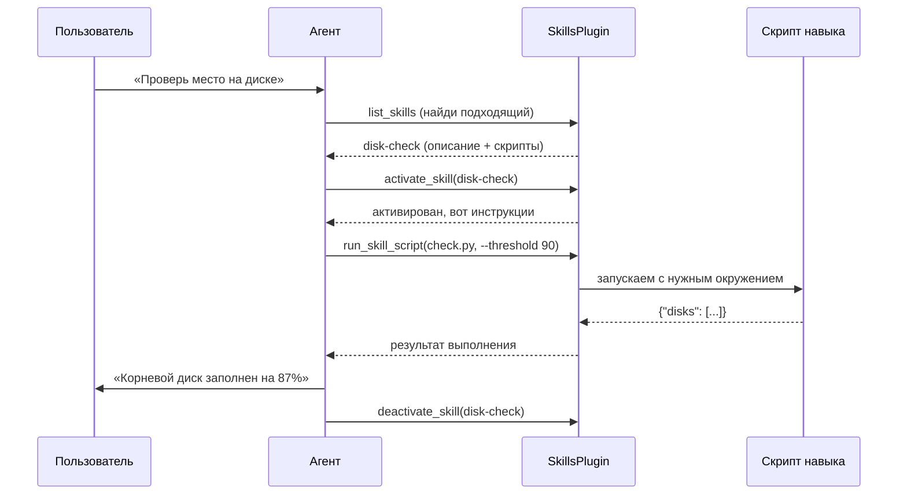

# Chapter 12: Система навыков

В [предыдущей главе](11_инструменты_агента.md) мы узнали, как **Инструменты агента** помогают боту планировать задачи, задавать уточняющие вопросы пользователю и доставлять результаты. Но представьте: агент научился всему этому, а у него в руках — только стандартный набор инструментов, как у швейцарского ножа. Хорошо для простых задач, но что если нужно что-то специфичное? Например, автоматически генерировать отчёты в корпоративном формате, анализировать логи по особой методике или взаимодействовать с внутренней системой компании? Вот здесь на сцену выходит **Система навыков** — волшебная мастерская, где можно создавать и использовать собственные «суперспособности» для бота.

## Зачем нужна Система навыков?

Представьте, что вы — врач. У вас есть стетоскоп, термометр, тонометр — стандартный набор. Но вдруг вы начинаете работать в кардиологии и вам нужен **ЭКГ-аппарат**. Или переходите в хирургию — нужен **лазерный скальпель**. Вы же не бросаете медицину, потому что стандартный набор не подходит? Нет — вы **добавляете специализированные инструменты** в свою практику.

**Система навыков** — это именно такая «специализированная клиника» для нашего бота. Она позволяет:

- Хранить **локальные скрипты** в специальных папках — каждый скрипт это отдельный «навык»
- **Активировать навыки** для конкретного чата или пользователя — как достать нужный инструмент из шкафчика
- **Запускать скрипты** как инструменты агента — бот сам решает, когда какой навык применить
- **Учиться на ошибках** — система запоминает, что пошло не так, и автоматически улучшает инструкции

### Конкретный пример

Алексей — DevOps-инженер. Его команда использует бота для мониторинга серверов. Сначала бот просто отвечал на вопросы. Но Алексею нужно было:

1. **Проверять дисковое пространство** на 50 серверах по особой схеме — с учётом специфических mount-point'ов
2. **Анализировать логи nginx** — выделять паттерны ошибок, которые важны именно их компании
3. **Генерировать отчёты о деплоях** — в формате, принятом в их Jira

Вместо того чтобы просить разработчиков бота добавить всё это в код, Алексей создал **три навыка** — папки со скриптами на Python. Теперь агент сам решает, когда запустить `disk-check`, когда — `nginx-analyzer`, а когда — `deploy-report`. И всё это работает «из коробки» без перезапуска бота!

## Как устроен навык?

Давайте разберём, из чего состоит навык, на примере простого скрипта проверки диска.

### Структура папки навыка

```
skills/
└── disk-check/           # ← папка навыка (ID навыка = имя папки)
    ├── SKILL.md          # ← инструкция для агента: что это, зачем, как использовать
    └── scripts/
        └── check.py      # ← собственно скрипт, который выполняет работу
```

Вот минимальный пример `SKILL.md` — «паспорта» навыка:

```markdown
---
name: Проверка диска
description: Проверяет свободное место на дисках сервера и предупреждает о критическом заполнении
---

## Когда использовать

Когда пользователь спрашивает о дисковом пространстве, свободном месте,
или жалуется на медленную работу системы.

## Параметры

Скрипт `check.py` принимает:
- `--threshold` — процент заполнения для предупреждения (по умолчанию 90)

## Пример вызова

```bash
python scripts/check.py --threshold 85
```

## Ожидаемый вывод

JSON с информацией о каждом диске: путь, размер, занято, свободно, статус.
```

А вот сам скрипт `scripts/check.py` — уже знакомый Python, но с особенностью: он получает окружение от системы навыков:

```python
#!/usr/bin/env python3
import json
import os
import shutil

# Получаем рабочую директорию, выделенную для этого скилла и чата
workdir = os.getenv("SKILL_WORKDIR", "/tmp")
# ID скилла — можно использовать для логирования
skill_id = os.getenv("SKILL_ID", "unknown")

# Парсим аргументы из командной строки
import argparse
parser = argparse.ArgumentParser()
parser.add_argument("--threshold", type=int, default=90)
args = parser.parse_args()

# Собираем информацию о дисках
disks = []
for part in shutil.disk_usage("/"),:  # упрощённо — только корень
    total, used, free = part
    percent = used / total * 100
    disks.append({
        "path": "/",
        "total_gb": round(total / 1e9, 2),
        "used_gb": round(used / 1e9, 2),
        "free_gb": round(free / 1e9, 2),
        "percent": round(percent, 1),
        "status": "warning" if percent > args.threshold else "ok"
    })

print(json.dumps({"disks": disks}, ensure_ascii=False))
```

После этого скрипта агент получает структурированный JSON и может красиво объяснить пользователю: *«Ваш корневой диск заполнен на 87% — ещё в порядке, но стоит следить»*.

## Жизненный цикл навыка: от поиска до выполнения

Теперь посмотрим, как навык проходит путь от «лежит в папке» до «решает задачу пользователя». Разберём по шагам, что происходит внутри `SkillsPlugin`.



Ключевой момент: агент **сам решает**, какой навык активировать, и **сам выбирает**, какой скрипт запустить с какими параметрами. `SkillsPlugin` — это не мозг, а **исполнительный механизм**: он находит навыки, проверяет права, запускает скрипты, следит за таймаутами.

## Как бот находит и использует навыки

### Шаг 1: Сканирование при старте

Когда плагин инициализируется, он проходит по папке `SKILLS_DIR` и читает все `SKILL.md`:

```python
# Из skills.py — упрощённый вариант сканирования
def _scan_skills(self):
    skills = {}
    for skill_path in self.skills_dir.iterdir():
        if not skill_path.is_dir():
            continue  # пропускаем файлы — нужны только папки
        
        md_file = skill_path / "SKILL.md"
        if not md_file.exists():
            continue  # без паспорта — не навык
        
        # Читаем YAML-заголовок и тело инструкций
        metadata, body = self._parse_skill_markdown(md_file.read_text())
        
        skills[skill_path.name] = {
            "id": skill_path.name,
            "name": metadata.get("name", skill_path.name),
            "description": metadata.get("description", ""),
            "scripts": self._list_skill_scripts(skill_path),
            "agents": self._list_skill_agents(skill_path),
            "body": body,
        }
    return skills
```

Получается «каталог навыков» — словарь, где ключи — имена папок, а значения — всё, что нужно агенту для принятия решений.

### Шаг 2: Регистрация инструментов

Плагин сообщает агенту, какие функции доступны. Вот ключевые инструменты:

```python
def get_spec(self):
    return [
        {
            "name": "list_skills",
            "description": "Показать доступные локальные навыки",
        },
        {
            "name": "activate_skill",
            "description": "Активировать навык для текущего чата",
            "parameters": {
                "skill_name": "ID навыка",
                "initial_context": "Начальный контекст задачи",
            },
        },
        {
            "name": "run_skill_script",
            "description": "Запустить скрипт из активного навыка",
            "parameters": {
                "skill_name": "ID навыка",
                "script_name": "Путь к скрипту",
                "args_json": "Аргументы в формате JSON",
            },
        },
        {
            "name": "run_skill_agent",
            "description": "Запустить сабагента из agents/*.yaml внутри навыка",
            "parameters": {
                "skill_name": "ID навыка",
                "agent_name": "ID агента, например openai",
                "task": "Конкретная задача для сабагента",
                "context": "Опциональный контекст",
            },
        },
        {
            "name": "deactivate_skill",
            "description": "Завершить работу с навыком",
        },
    ]
```

`agents/*.yaml` не запускает ничего само по себе. При сканировании skill-плагин
только запоминает доступные профили. Реальный сабагент создаётся лениво, когда
модель вызывает `skills.run_skill_agent(skill_name, agent_name, task)`. Тогда
профиль агента превращается в один item для `agent_tools.run_subagents`.
Например, профиль из `agents/openai.yaml`:

```yaml
interface:
  display_name: "Novel Writing"
  short_description: "Plan, draft, and review fiction"
  default_prompt: "Use $novel-writing to plan, draft, or review a fiction chapter."
```

даёт агенту роль `Novel Writing`, default prompt и контекст skill’а, но
создаётся только в момент, когда он нужен для конкретной задачи.

### Шаг 3: Активация — «включаем контекст»

Активация — это как открыть рабочую папку для проекта. Система создаёт запись о том, что в этом чате сейчас работает такой-то навык, на каком шаге, с каким контекстом:

```python
def _activate_skill(self, skill_name, initial_context=None, **kwargs):
    # «Адрес» текущего чата: комбинация chat_id + user_id
    scope = compute_scope_key(kwargs.get("chat_id"), kwargs.get("user_id"))
    
    with self._state_lock:  # потокобезопасно
        self.active_skills.setdefault(scope, {})
        self.active_skills[scope][skill_id] = {
            "current_step": 0,
            "context": self._decode_context(initial_context),
            "activated_at": int(time.time()),
        }
        self._save_state()  # сохраняем в JSON на диск
```

Это позволяет вести **долгие диалоги** с навыком: активировали сегодня, продолжили завтра — состояние не потеряется.

### Шаг 4: Запуск скрипта — «выполняем работу»

Самое интересное — запуск скрипта. Система готовит безопасное окружение:

```python
async def _run_skill_script(self, skill_name, script_name, args_json=None, **kwargs):
    # Проверяем права: разрешены ли скрипты вообще?
    if not self.allow_scripts:
        return {"success": False, "error": "Скрипты отключены"}
    
    # Проверяем: является ли пользователь админом?
    if not self._is_script_admin(kwargs.get("user_id")):
        return {"success": False, "error": "Нет прав на запуск скриптов"}
    
    # Проверяем: активирован ли навык в этом чате?
    scope = compute_scope_key(kwargs.get("chat_id"), kwargs.get("user_id"))
    if skill_id not in self.active_skills.get(scope, {}):
        return {"success": False, "error": "Навык не активирован"}
    
    # Собираем команду: python, node, bash или исполняемый файл
    command, runtime, error = self._script_command(script_path)
    
    # Создаём рабочую директорию для этого чата
    workdir = self._ensure_skill_workdir(skill_id, scope)
    
    # Запускаем с таймаутом и ограничением вывода
    process = await asyncio.create_subprocess_exec(
        *command, *argv,
        cwd=str(skill_path),  # ← скрипт видит файлы навыка
        env=self._script_env(skill_id=skill_id, scope=scope, workdir=workdir),
    )
    stdout, stderr = await asyncio.wait_for(
        process.communicate(), 
        timeout=self.script_timeout
    )
```

Обратите внимание на переменные окружения — они связывают скрипт с контекстом выполнения:

| Переменная | Назначение |
|------------|-----------|
| `SKILL_ID` | Какой навык выполняется |
| `SKILL_SCOPE` | В каком чате/для какого пользователя |
| `SKILL_WORKDIR` | Где скрипт может хранить временные файлы |

### Шаг 5: Завершение или продолжение

После выполнения агент может:
- **Обновить прогресс** — `update_skill_progress` — отметить, что шаг 1 сделан, перейти к шагу 2
- **Деактивировать** — `deactivate_skill` — закрыть «папку проекта»
- **Или ничего не делать** — навык остаётся активным для следующих сообщений

## Умное обучение: рефлексия навыков

Вот что делает систему по-настоящему умной. Представьте: скрипт `check.py` упал, потому что на сервере нет команды `df` (стандартной утилиты Unix). Агент видит ошибку и предлагает: *«Нужно добавить в SKILL.md примечание: если df недоступна, использовать shutil.disk_usage»*.

Система **запоминает это предложение**. Если похожая ошибка повторяется **более 3 раз**, предложение **автоматически дописывается** в `SKILL.md` в раздел `## Learned Clarifications`:

```python
def _record_skill_reflection(self, skill_name, proposal, failure_mode=None, evidence=None):
    # Создаём уникальный ID предложения по его тексту
    proposal_id = self._reflection_id(proposal_text)
    
    with self._reflection_lock:
        # Увеличиваем счётчик «видели ли это предложение»
        entry = self.skill_reflections[skill_id].setdefault(proposal_id, {
            "count": 0,
            "proposal": proposal_text,
        })
        entry["count"] += 1
        
        # Порог преодолён? Дописываем в SKILL.md!
        if entry["count"] > REFLECTION_REPEAT_THRESHOLD and not entry.get("applied_at"):
            edit_result = self._append_skill_reflection(skill_id, proposal_text)
            # Перечитываем навык с обновлёнными инструкциями
            self._scan_cache = None
            self.available_skills = self._scan_skills()
```

Это как **опытный коллега**, который подходит после третьей одинаковой ошибки и говорит: *«Давай запишем это в инструкцию, чтобы больше не наступать на те же грабли»*.

## Установка навыков из внешних источников

Кроме ручного создания, можно устанавливать навыки через CLI `skills` (похоже на `npm install`):

```python
async def _find_installable_skills(self, query):
    # Ищем через skills CLI: например, «skills find testing»
    result = await self._run_skills_cli(["find", query], timeout=self.install_timeout)
    # Парсим вывод: формат «владелец/репозиторий@название»
    return self._parse_installable_skill_results(result["stdout"])

async def _install_skill(self, package, skill_name=None, confirmed=False, **kwargs):
    # Проверяем: подтвердил ли пользователь установку?
    if not confirmed:
        return {"success": False, "error": "Требуется явное подтверждение пользователя"}
    
    # Запускаем: skills add owner/repo@skill -g --copy
    result = await self._run_skills_cli(
        ["add", package, "-g", "--agent", "codex", "--copy", "-y"],
        timeout=self.install_timeout,
    )
    # Синхронизируем в SKILLS_DIR
    self._sync_installed_skill(source_path, target_path)
```

Это позволяет делиться навыками в командах или публиковать их в реестре — как пакеты в PyPI или npm.

## Безопасность: кто может что делать

Система навыков потенциально опасна: скрипты выполняют произвольный код! Поэтому встроены несколько уровней защиты:

```python
# .env — настройки безопасности
SKILLS_ALLOW_SCRIPTS=true          # разрешить скрипты вообще?
SKILLS_SCRIPT_ADMIN_USER_IDS=*     # кто может запускать: * = все, или 12345,67890
SKILLS_ALLOW_INSTALLS=true         # разрешить установку новых навыков?
SKILLS_INSTALL_ADMIN_USER_IDS=*    # кто может устанавливать
SKILLS_SCRIPT_TIMEOUT=120          # максимальное время выполнения (сек)
SKILLS_SCRIPT_OUTPUT_MAX_CHARS=12000  # ограничение вывода
```

Каждый запуск логируется в `skills_audit.jsonl` — как «чёрный ящик» для расследований:

```json
{"ts": 1700000000, "action": "run_skill_script", "skill": "disk-check", "script": "check.py", "user_id": 12345, "returncode": 0, "duration_ms": 150}
```

## Пример полного диалога

Давайте соберём всё вместе — как это выглядит с точки зрения пользователя:

**Пользователь:** Проверь диски на сервере, порог 85%

**Бот (внутри агента):**
1. Вызов `list_skills` → находит `disk-check`
2. Вызов `activate_skill("disk-check", "проверка дисков, порог 85%")`
3. Вызов `run_skill_script("disk-check", "check.py", '{"--threshold": 85}')`
4. Получает результат, формирует ответ
5. Вызов `deactivate_skill("disk-check")`

**Бот (пользователю):**
> Проверил диски. Результат:
> - `/` — 87.5 Гб свободно из 500 Гб (82.5% занято) ✅ **ok**
> - `/var/log` — 2.1 Гб свободно из 20 Гб (89.5% занято) ⚠️ **warning** — приближается к порогу 85%

## Заключение

В этой главе мы узнали, как **Система навыков** превращает бота из универсального собеседника в **специализированного помощника** с кастомными способностями. Мы разобрали:

- **Структуру навыка** — папка с `SKILL.md` и `scripts/`
- **Жизненный цикл** — сканирование, активация, выполнение, деактивация
- **Безопасность** — права доступа, таймауты, аудит
- **Самообучение** — рефлексия и автоматическое улучшение инструкций

Система навыков — это мост между миром **творческого диалога** (где агент решает, что делать) и миром **точных скриптов** (которые делают конкретную работу). Она позволяет расширять бота без изменения его кода — как добавлять новые программы на компьютер, не перепаивая материнскую плату.

В [следующей главе](13_веб_поиск.md) мы познакомимся с **Веб-поиском** — инструментом, который позволяет агенту выходить за пределы своих знаний и искать свежую информацию в интернете. Представьте: навык анализирует диски, а веб-поиск находит, какие ещё утилиты существуют для мониторинга! Увидимся там.

---

Generated by MultiAgent
