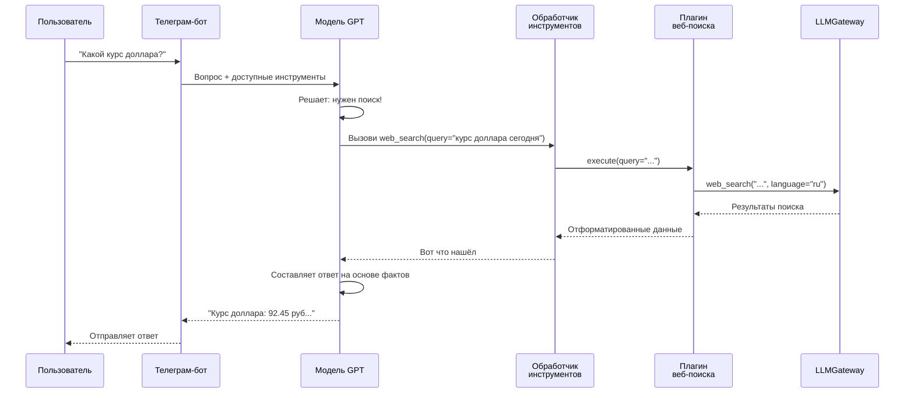

# Chapter 13: Веб-поиск

В [предыдущей главе](12_система_навыков.md) мы узнали, как **Система навыков** позволяет создавать собственные «суперспособности» для бота — специализированные скрипты под конкретные задачи. Но представьте: у бота есть все эти навыки, а он не знает, что происходит в мире *прямо сейчас*. Пользователь спрашивает: *«Какая погода в Москве?»* или *«Какие новости о запуске нового iPhone?»* — а бот отвечает на основе старых знаний модели, которые устарели месяц назад. Вот здесь на сцену выходит **Веб-поиск** — способность бота «выглянуть в окно» интернета и узнать актуальную информацию.

## Зачем нужен Веб-поиск?

Представьте, что вы — студент, готовящийся к экзамену по текущим событиям. Вы открыли учебник, но он издан три года назад. Как узнать, кто сейчас президент, какая сегодня погода, или какие фильмы идут в кино? Конечно, вы возьмёте телефон и **поищете в интернете**!

**Веб-поиск** — это именно такой «телефон с доступом к интернету» для нашего бота. Он позволяет:

- Получать **свежую информацию** — новости, погода, курсы валют, спортивные результаты
- Проверять **факты** — уточнять даты, имена, цифры, которые могли измениться
- Искать **конкретные данные** — рецепты, инструкции, расписания, адреса

### Конкретный пример

Алексей спрашивает бота: *«Какой курс доллара сегодня и стоит ли покупать евро?»*

Без веб-поиска бот ответит примерно так: *«По состоянию на мои последние данные, курс доллара был около 90 рублей, но точную цифру на сегодня я не знаю»* — разочарование гарантировано.

С веб-поиском бот **сам зайдёт в интернет**, найдёт актуальный курс на сегодняшний день и даст осмысленный совет.

## Как устроен Веб-поиск в нашем боте?

Наш бот использует **LLMGateway** — специальный шлюз, который выполняет поиск в интернете от имени бота. Давайте разберём, как это работает шаг за шагом.

### Три ключевых понятия

#### 1. Плагин поиска — «проводник в интернет»

Плагин — это модуль, который «умеет» искать в интернете. Он регистрируется в [Менеджере плагинов](09_менеджер_плагинов.md) и сообщает модели: *«Если нужно что-то найти — обращайся ко мне!»*

#### 2. Спецификация функции — «визитная карточка»

Это описание того, что умеет плагин и какие параметры принимает. Модель читает это описание и понимает: *«Ага, для поиска мне нужен запрос `query`, можно указать язык `region` и количество результатов `max_results`»*.

#### 3. Выполнение поиска — «сам поход в интернет»

Когда модель решает, что нужен поиск, [Обработчик инструментов](10_обработчик_инструментов.md) вызывает метод `execute` плагина, который обращается к LLMGateway и возвращает результаты.

## Посмотрим на код

Вот наш плагин веб-поиска. Он живёт в файле `bot/plugins/ddg_web_search.py`:

```python
class DDGWebSearchPlugin(Plugin):
    """Поиск в интернете через LLMGateway"""

    def get_source_name(self) -> str:
        return "LLMGateway Web Search"
```

*Этот метод просто возвращает имя источника — чтобы в ответе бота было понятно, откуда информация.*

Теперь самое важное — спецификация, которую читает модель:

```python
def get_spec(self) -> [Dict]:
    return [{
        "name": "web_search",
        "description": "Выполнить поиск в интернете через LLMGateway",
        "parameters": {
            "type": "object",
            "properties": {
                "query": {
                    "type": "string",
                    "description": "запрос пользователя"
                },
                "region": {
                    "type": "string",
                    "description": "язык поиска (например, ru-ru или en-us)"
                },
                "max_results": {
                    "type": "integer",
                    "description": "сколько результатов вернуть",
                    "default": 5
                }
            },
            "required": ["query"],
        },
    }]
```

*Здесь мы «учим» модель: есть функция `web_search`, ей обязательно нужен `query` (что искать), а `region` и `max_results` — по желанию. Модель сама решает, какие параметры передать, исходя из вопроса пользователя.*

Главный метод — выполнение поиска:

```python
async def execute(self, function_name, helper, **kwargs):
    # Получаем параметры от модели
    query = kwargs.get('query', '').strip()
    max_results = int(kwargs.get("max_results", 5))
    language = _language_from_region(kwargs.get("region", "ru-ru"))
    
    # Идём в интернет через LLMGateway
    data = await helper.gateway_client.web_search(
        query,
        max_results=max_results,
        language=language,
    )
```

*Метод `execute` — это «поход в магазин». Модель дала список покупок (`kwargs`), мы его распаковали и пошли в LLMGateway за товаром (информацией).*

Форматируем результат для модели:

```python
    results = data.get("data", [])
    
    formatted_results = [
        {
            "snippet": item.get("snippet", ""),   # короткое описание
            "title": item.get("title", ""),        # заголовок страницы
            "link": item.get("url", ""),           # ссылка
        }
        for item in results
    ]
    
    return {"result": formatted_results}
```

*Мы аккуратно упаковываем найденное — заголовки, описания, ссылки — и несём обратно модели, чтобы она составила понятный ответ пользователю.*

## Что происходит «под капотом»?

Давайте проследим путь вопроса пользователя от начала до конца:



**Шаг за шагом:**

1. **Пользователь спрашивает** — обычное сообщение в Telegram
2. **Бот передаёт вопрос модели** вместе со списком доступных инструментов (включая наш `web_search`)
3. **Модель «думает»** — она видит, что вопрос требует свежих данных, и решает вызвать поиск
4. **[Обработчик инструментов](10_обработчик_инструментов.md) маршрутизирует** вызов к плагину веб-поиска
5. **Плагин идёт в LLMGateway** — специальный сервис, который умеет искать в интернете
6. **Результаты возвращаются** по цепочке обратно к модели
7. **Модель составляет финальный ответ** — уже с актуальными данными!

## Пример настроек языка

Плагин умный — он понимает, на каком языке искать:

```python
def _language_from_region(region: str) -> str:
    region = (region or "").lower()
    if "-ru" in region:
        return "ru"      # русский язык
    if "-en" in region:
        return "en"      # английский язык
    return "ru"          # по умолчанию — русский
```

*Это как выбор страницы поисковика: google.ru или google.com. Если пользователь говорит по-русски — ищем по-русски, чтобы результаты были релевантнее.*

## Обработка ошибок

Что если интернет не работает? Плагин не паникует:

```python
try:
    # ... поиск ...
except Exception as e:
    error_msg = f"Ошибка выполнения поиска: {str(e)}"
    return {"error": error_msg}
```

*Модель получит сообщение об ошибке и мягко сообщит пользователю: «Не удалось выполнить поиск, попробуйте позже» — вместо красного экрана смерти.*

## Как это выглядит для пользователя?

| Вопрос пользователя | Что делает модель | Результат |
|:---|:---|:---|
| «Какая погода в Питере?» | Вызывает `web_search(query="погода Санкт-Петербург сегодня")` | Актуальный прогноз на сегодня |
| «Новости о ИИ» | Вызывает `web_search(query="новости искусственный интеллект", max_results=10)` | Подборка свежих статей |
| «Рецепт борща» | Может не вызывать поиск — знает из памяти, или вызовет для точности | Проверенный рецепт с сайта |

## Заключение

В этой главе мы узнали, как **Веб-поиск** превращает бота из «затворника с устаревшими знаниями» в «пытливого исследователя с доступом к актуальной информации». Мы разобрали:

- Зачем боту нужен доступ к интернету — для свежих данных и фактов
- Как устроен плагин поиска — спецификация, параметры, выполнение
- Как проходит путь запроса — от пользователя через модель и плагин к LLMGateway и обратно
- Как плагин выбирает язык поиска и обрабатывает ошибки

Веб-поиск — это мост между миром знаний модели и реальным, постоянно меняющимся интернетом. С ним бот может отвечать на вопросы о сегодняшнем дне, а не только о прошлом.

В [следующей главе](14_интерпретатор_кода.md) мы познакомимся с ещё одной мощной способностью — **Интерпретатором кода**. Это инструмент, который позволяет боту не просто *знать* о программировании, а **реально выполнять код**: считать сложные формулы, строить графики, обрабатывать данные. Представьте, что бот не только подскажет формулу для расчёта ипотеки, но и **сам посчитает** её для ваших цифер!

---

Generated by MultiAgent