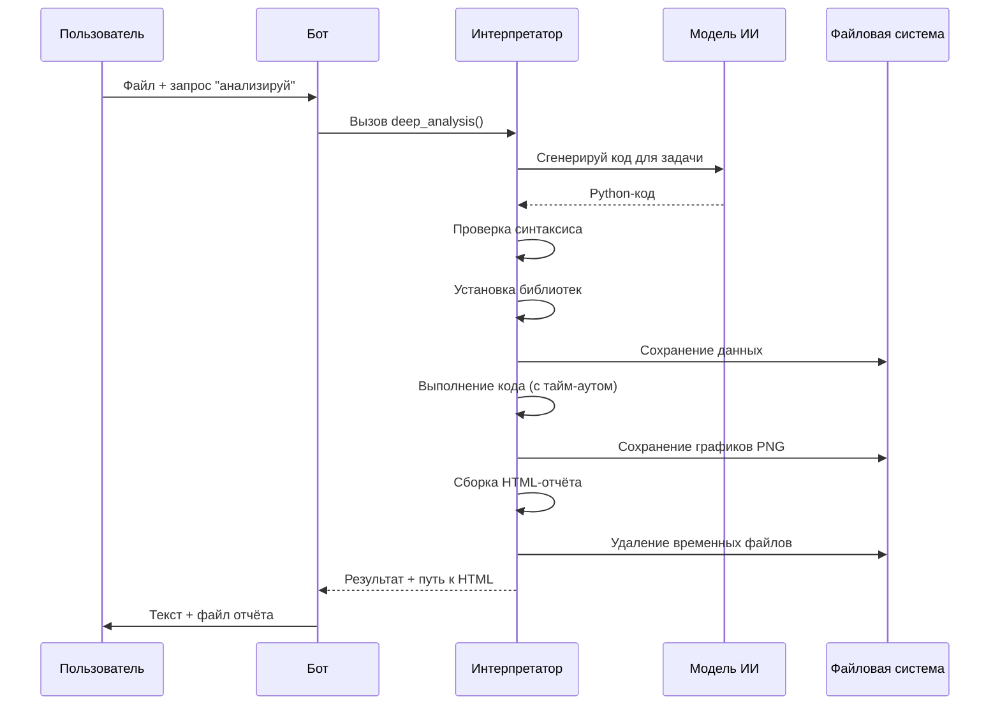

# Chapter 14: Интерпретатор кода

В [предыдущей главе](13_веб_поиск.md) мы узнали, как **Веб-поиск** позволяет боту «выглянуть в окно» интернета и получать актуальную информацию. Но представьте: пользователь прислал боту CSV-файл с продажами за год и спрашивает — *«Построй график трендов и посчитай, в каком месяце был пик»*. Или просит: *«Реши это уравнение и визуализируй функцию»*. Веб-поиск тут не поможет — нужно что-то вроде карманного программиста, который напишет код, запустит его и покажет результат. Вот здесь на сцену выходит **Интерпретатор кода** — личный Python-разработчик бота в миниатюре.

## Зачем нужен Интерпретатор кода?

Представьте, что вы — учитель математики. Ученик спрашивает: *«А что будет, если я нарисую график функции x² от -10 до 10?»* Вы можете:
1. Взять листочек и карандаш — рисовать вручную долго и неточно
2. Открыть компьютер, запустить Python, написать код, сохранить картинку — это работа на 10 минут
3. **Попросить помощника** — и через секунду получить готовый график

**Интерпретатор кода** — это именно такой «математический помощник» для нашего бота. Он позволяет:
- **Выполнять Python-код** — прямо внутри бота, без установки чего-либо на компьютер пользователя
- **Генерировать визуализации** — графики, диаграммы, интерактивные HTML-страницы
- **Анализировать данные** — загружать CSV, Excel, JSON и проводить вычисления
- **Автоматически исправлять ошибки** — если код не заработал с первого раза

### Конкретный пример

Мария — аналитик в небольшой компании. Каждую пятницу ей нужно строить отчёт по продажам. Она привыкла делать это в Excel, но это занимает час. Теперь она просто кидает боту файл `sales.csv` и пишет:

> *«Покажи динамику продаж по месяцам, выдели топ-3 менеджера, построй круговую диаграмму по регионам»*

Бот через **Интерпретатор кода** генерирует Python-скрипт, выполняет его, получает графики — и отправляет Марии красивый HTML-отчёт с картинками. Всё за 30 секунд.

## Ключевые концепции

Давайте разберём, из чего состоит этот «карманный программист».

### Концепция 1: Генерация кода по описанию

Не все пользователи умеют программировать. Поэтому Интерпретатор умеет **переводить слова в код**.

```python
# Пользователь написал: "Построй график синуса"
# Бот сам создаёт такой код:

import numpy as np
import matplotlib.pyplot as plt

x = np.linspace(0, 2*np.pi, 100)
y = np.sin(x)
plt.plot(x, y)
plt.title('График синуса')
plt.savefig('output/plots/sinus_abc123.png')
```

**Как это работает:** бот отправляет описание задачи в языковую модель (OpenAI), а та возвращает готовый Python-код. Это как если бы вы объяснили задачу опытному программисту — и он мгновенно написал решение.

### Концепция 2: Изолированное выполнение

Запускать чужой код опасно — он может удалить файлы или зависнуть. Поэтому код выполняется в **песочнице** с защитой:

```python
# Опасный код будет заблокирован
if "rm -r" in code or "os.system" in code:
    raise SecurityError("Обнаружен потенциально опасный код")

# Время выполнения ограничено — не зависнет навечно
with timeout(120):  # максимум 2 минуты
    exec(code, safe_globals, safe_locals)
```

**Аналогия:** представьте детскую площадку с мягким покрытием и ограждением. Ребёнок может бегать, прыгать, играть — но не убежит на дорогу и не поранится. Так и здесь: код может считать, рисовать, анализировать — но не выйдет за пределы разрешённого.

### Концепция 3: Автоматическая отладка

Программы часто не работают с первого раза. Интерпретатор умеет **исправлять ошибки сам**:

```python
# Попытка 1: код упал с ошибкой "ModuleNotFoundError: No module named 'seaborn'"
# → Интерпретатор автоматически устанавливает: pip install seaborn

# Попытка 2: код упал с синтаксической ошибкой
# → Интерпретатор просит ИИ исправить код и пробует снова

# Попытка 3: успех!
```

Максимум **3 попытки** — как у студента на экзамене: три шанса сдать зачёт.

### Концепция 4: Визуализация результатов

Сухие цифры — скучно. Интерпретатор создаёт **красивые HTML-отчёты** с графиками:

```python
# Графики сохраняются как PNG-файлы
plt.savefig('output/plots/chart_abc123.png')

# Затем собираются в единую HTML-страницу
# с удобной прокруткой и подписями
```

Результат: пользователь получает один файл, открывает в браузере — и видит все графики разом.

## Решение задачи: анализ данных за 5 шагов

Давайте проследим, как Мария получает свой отчёт по продажам.

### Шаг 1: Пользователь отправляет запрос

```
Мария → Бот: файл sales.csv + текст "Покажи динамику по месяцам"
```

### Шаг 2: Бот определяет, что нужен Интерпретатор

Бот видит файл данных и задачу анализа — вызывает плагин `deep_analysis`.

```python
# Внутри плагина создаётся уникальная сессия
session_id = str(uuid.uuid4())[:8]  # например: "a3f7b2c9"
```

### Шаг 3: Генерация кода

```python
# Формируется подробный промпт для ИИ
prompt = f"""
Создай Python-код для решения задачи.
Код должен содержать if __name__ == "__main__":
Все графики сохраняй в 'output/plots' с суффиксом _{session_id}
Все комментарии на русском языке!

Задача: Покажи динамику продаж по месяцам из файла {data_path}
"""
```

### Шаг 4: Выполнение с защитой

```python
# Проверяем синтаксис перед запуском
result = analyze_code_syntax(generated_code)
# → {"status": True}  или  {"error": "синтаксическая ошибка"}

# Устанавливаем нужные библиотеки автоматически
await install_package("pandas")   # если не установлена
await install_package("matplotlib")  # если не установлена

# Запускаем с тайм-аутом и перехватом вывода
result = await execute_code(generated_code)
```

### Шаг 5: Формирование ответа

```python
# Если есть графики — собираем HTML
if os.path.exists('output/plots'):
    advanced_visualization(result, session_id)
    # → файл output/interactive_plots_a3f7b2c9.html

# Отправляем пользователю
return {
    "result": "Анализ завершён! Пик продаж был в декабре: 2.3 млн ₽",
    "direct_result": {
        "kind": "file",
        "format": "path", 
        "value": "output/interactive_plots_a3f7b2c9.html"
    }
}
```

## Что происходит «под капотом»

Давайте посмотрим на полную картину взаимодействия.



### Ключевые моменты реализации

**Безопасность через контекстный менеджер:**

```python
@contextmanager
def timeout(seconds: int):
    """Таймер-охранник: будит через N секунд"""
    def handler(signum, frame):
        raise TimeoutException("Время вышло!")
    
    signal.signal(signal.SIGALRM, handler)
    signal.alarm(seconds)  # заводим будильник
    
    try:
        yield  # выполняем код пользователя
    finally:
        signal.alarm(0)  # выключаем будильник
```

**Перехват вывода print:**

```python
output_buffer = StringIO()      # виртуальный листок бумаги
sys.stdout = output_buffer    # перенаправляем "принтер"

exec(code)  # код пишет сюда вместо экрана

sys.stdout = original_stdout  # возвращаем настоящий экран
captured = output_buffer.getvalue()  # читаем, что написал код
```

**Проверка на «похожесть на код»:**

```python
def _looks_like_python_code(self, text: str) -> bool:
    # Пользователь прислал готовый код?
    # Или просто описание на русском?
    markers = [
        r"^\s*import\s+",      # строка с import
        r"^\s*def\s+",         # определение функции
        r"^\s*print\(",         # вызов print
    ]
    # ...проверяем и решаем: генерировать или выполнить как есть
```

## Как пользоваться: примеры запросов

| Что написать боту | Что произойдёт |
|---|---|
| `Построй график y = x²` | Сгенерирует код, выполнит, пришлёт PNG |
| `Вот файл data.csv — посчитай среднее` | Загрузит CSV, вычислит `df.mean()`, пришлёт результат |
| `import pandas as pd; print(pd.__version__)` | Выполнит как готовый код |
| `Сравни два графика: синус и косинус` | Две картинки в одном HTML-отчёте |

## Заключение

В этой главе мы познакомились с **Интерпретатором кода** — мощным инструментом, который превращает бота в карманного data-scientist'а. Мы узнали:

- Как бот **генерирует код по описанию** — благодаря языковой модели
- Как код выполняется **безопасно и изолированно** — с тайм-аутом и фильтрацией опасных команд
- Как **автоматическая отладка** спасает от ошибок — до трёх попыток исправления
- Как **визуализации** превращаются в красивые HTML-отчёты

Этот инструмент открывает боту целый мир: математика, статистика, визуализация, обработка данных — всё становится доступным через простой текстовый разговор.

Но что, если пользователю нужно не просто выполнить код, а **поработать в настоящей командной строке**? Запустить `git`, `ffmpeg`, или свой скрипт? В следующей главе мы откроем для бота дверь в мир системных команд — встречайте [Терминал](15_терминал.md).

---

Generated by MultiAgent