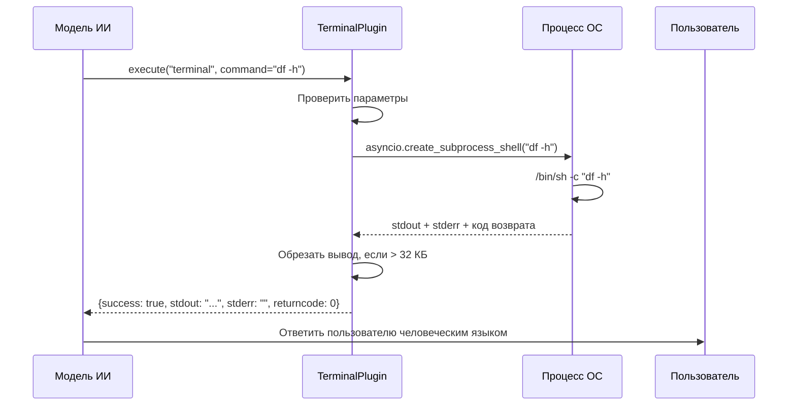

# Chapter 15: Терминал

В [предыдущей главе](14_интерпретатор_кода.md) мы узнали, как **Интерпретатор кода** позволяет боту запускать Python-скрипты — строить графики, анализировать данные и визуализировать результаты. Но представьте: пользователь спрашивает — *«Проверь, сколько места осталось на диске сервера»* или *«Покажи последние 20 строк лога моего приложения»*. Python-код тут излишен — нужно просто выполнить команду в терминале, как будто вы сидите за клавиатурой сервера. Вот здесь на сцену выходит **Терминал** — прямой проводник в мир командной строки вашего сервера.

## Зачем нужен Терминал?

Представьте, что вы — системный администратор, и вам звонит коллега из другого города: *«У меня упал веб-сайт, что делать?»* Вы не полезете писать Python-программу для проверки — вы быстро введёте в терминал:

```bash
df -h          # сколько места на диске
systemctl status nginx   # работает ли веб-сервер
tail -n 20 /var/log/nginx/error.log   # последние ошибки
```

**Терминал** — это именно такой «удалённый доступ к командной строке» для нашего бота. Он позволяет:
- **Выполнять shell-команды** — `ls`, `cat`, `grep`, `curl` и любые другие утилиты Linux
- **Проверять состояние сервера** — место на диске, загрузку CPU, работающие процессы
- **Читать логи и конфиги** — быстро посмотреть содержимое файлов
- **Использовать pipes и цепочки** — `cat file | grep error | wc -l` работает из коробки

### Конкретный пример

Дмитрий — разработчик, развёртывающий бота на своём сервере. Он спрашивает бота: *«Проверь, запущен ли мой бэкенд и сколько он жрёт памяти»*

Без терминала бот ответит: *«Я не могу заглянуть внутрь сервера — у меня нет таких инструментов»*

С терминалом бот выполнит:
```bash
ps aux | grep backend | grep -v grep
free -h
```

И ответит: *«Нашёл процесс backend-app (PID 1842), потребляет 340 МБ RAM. Свободной памяти на сервере: 2.1 ГБ»*

---

## Как устроен Терминал: ключевые концепции

### Концепция 1: Два режима выполнения — «через оболочку» и «напрямую»

Представьте, что вы просите помощника купить продукты. Есть два способа:

**Режим «через переводчика» (shell=true, по умолчанию):**
Вы говорите: *«Купи молоко, а если его нет — купи кефир»*. Переводчик (оболочка `/bin/sh`) сам решает логику `&&`, `||`, `|`, перенаправления `>`.

**Режим «напрямую» (shell=false):**
Вы говорите точную команду: *«Купи именно молоко 2.5%»*. Никаких ухищрений — только конкретная программа.

```python
# Режим "через оболочку" — работают pipes, &&, ||
"command": "cat /var/log/app.log | grep ERROR | tail -n 5"
# shell=true (по умолчанию)

# Режим "напрямую" — безопаснее, но без магии оболочки
"command": "python3 /tmp/script.py"
# shell=false — запустит именно python3, а не интерпретатор sh
```

### Концепция 2: Рабочая директория — «где мы стоим»

Каждая команда выполняется в определённой папке. По умолчанию это `/tmp` — временная папка, безопасная для экспериментов.

```python
# Выполнить в домашней папке бота
"cwd": "/home/botuser"

# Выполнить в папке логов
"cwd": "/var/log/myapp"
```

### Концепция 3: Таймаут и ограничение вывода

Представьте, что вы случайно запустили бесконечный цикл. Бот не будет ждать вечно:

```python
# Максимум 260 секунд по умолчанию
"timeout": 30   # или свой таймаут

# Вывод обрезается после 32 КБ — чтобы не перегрузить чат
```

---

## Что происходит «под капотом»: пошаговая разборка

Когда бот решает выполнить терминальную команду, работает такая цепочка:



---

## Разбор кода плагина

Весь терминал живёт в одном файле: `bot/plugins/terminal.py`. Разберём его частями.

### Объявление плагина и константы

```python
import asyncio      # для асинхронных процессов
import shlex        # для безопасного разбора команд
from pathlib import Path   # для работы с путями

DEFAULT_TIMEOUT_SECONDS = 260   # 4 минуты 20 секунд
DEFAULT_CWD = "/tmp"            # безопасная папка по умолчанию
OUTPUT_BYTE_LIMIT = 32 * 1024   # ~32 килобайта вывода
```

Константы защищают от «зависаний» и перегрузки чата огромным выводом.

### Спецификация для ИИ: что умеет терминал

```python
def get_spec(self) -> List[Dict]:
    return [{
        "name": "terminal",
        "description": (
            "Execute a command and return stdout, stderr, and the return code. "
            "By default runs via /bin/sh -c (shell=true)..."
        ),
        "parameters": {
            "type": "object",
            "properties": {
                "command": {"type": "string", ...},
                "shell": {"type": "boolean", ...},
                "cwd": {"type": "string", ...},
                "timeout": {"type": "number", ...},
            },
            "required": ["command"],
        },
    }]
```

Эта спецификация — инструкция для [Менеджера плагинов](09_менеджер_плагинов.md). Он передаёт её [Обработчику инструментов](10_обработчик_инструментов.md), а тот — модели ИИ. Модель «понимает», что может вызвать `terminal` с параметром `command`.

### Проверка параметров: защита от дурака

```python
async def execute(self, function_name: str, helper: Any, **kwargs: Any) -> Dict:
    # Проверяем, что вызван именно наш инструмент
    if function_name != "terminal":
        return {"error": f"Unknown function: {function_name}"}

    command = kwargs.get("command")
    # Команда должна быть непустой строкой
    if not isinstance(command, str) or not command.strip():
        return {"error": "command must be a non-empty string"}
```

### Выбор режима: shell или прямой запуск

```python
shell = bool(kwargs.get("shell", True))   # по умолчанию через /bin/sh

if shell:
    # Режим "переводчика": передаём команду как есть
    process = await asyncio.create_subprocess_shell(
        command,
        cwd=str(cwd_path),
        stdout=asyncio.subprocess.PIPE,
        stderr=asyncio.subprocess.PIPE,
    )
else:
    # Режим "точной команды": разбираем на аргументы
    argv = shlex.split(command)   # "echo 'hello world'" → ["echo", "hello world"]
    process = await asyncio.create_subprocess_exec(
        *argv,   # распаковываем список аргументов
        cwd=str(cwd_path),
        stdout=asyncio.subprocess.PIPE,
        stderr=asyncio.subprocess.PIPE,
    )
```

### Ожидание результата с защитой от зависания

```python
try:
    # Ждём завершения, но не дольше таймаута
    stdout_bytes, stderr_bytes = await asyncio.wait_for(
        process.communicate(), timeout=timeout
    )
except asyncio.TimeoutError:
    # Убиваем зависший процесс
    process.kill()
    return {"success": False, "error": f"Command timed out after {timeout}s"}
```

### Формирование ответа и обрезка

```python
stdout = self._truncate(stdout_bytes.decode("utf-8", errors="replace"))
stderr = self._truncate(stderr_bytes.decode("utf-8", errors="replace"))

return {
    "success": process.returncode == 0,   # 0 = успех в Unix
    "returncode": process.returncode,
    "stdout": stdout,
    "stderr": stderr,
    "cwd": str(cwd_path),
    "shell": shell,
}
```

### Метод обрезки: защита от «стены текста»

```python
@staticmethod
def _truncate(text: str) -> str:
    encoded = text.encode("utf-8", errors="replace")
    if len(encoded) <= OUTPUT_BYTE_LIMIT:
        return text
    # Обрезаем и добавляем пометку
    return encoded[:OUTPUT_BYTE_LIMIT].decode("utf-8", errors="ignore") + "\n... [truncated]"
```

---

## Практический пример: диагностика сервера

Пользователь спрашивает: *«Почему мой сайт тормозит?»*

Модель ИИ решает использовать терминал и вызывает:

```python
# Первый запрос: проверка диска
{
    "command": "df -h | grep -E '(/$|/var)'",
    "shell": true
}
# Ответ: {stdout: "/dev/sda1  50G   48G  2G  97% /", ...}
# Диск почти полон!
```

```python
# Второй запрос: проверка памяти
{
    "command": "free -h",
    "shell": true
}
# Ответ: {stdout: "Mem: 2.0Gi 1.8Gi ... Swap: 2.0Gi 1.9Gi", ...}
# Память и swap тоже на пределе!
```

```python
# Третий запрос: кто жрёт ресурсы
{
    "command": "ps aux --sort=-%mem | head -n 5",
    "shell": true
}
# Ответ показывает: процесс python3 (PID 1842) жрёт 1.2 ГБ RAM
```

Итоговый ответ пользователю: *«Нашёл проблему! Диск заполнен на 97%, память и swap на пределе. Процесс python3 (PID 1842) потребляет 1.2 ГБ RAM — вероятно, это утечка памяти. Рекомендую перезапустить сервис и проверить логи»*

---

## Важное предупреждение: безопасность

Терминал — это **мощный и опасный** инструмент. Представьте, что вы дали кому-то полный доступ к командной строке вашего сервера.

```python
# ОПАСНО: такая команда уничтожит данные!
{"command": "rm -rf /important-data"}

# ОПАСНО: утечка секретов!
{"command": "cat /etc/bot/.env"}
```

**Защитные меры в проекте:**
- По умолчанию работаем в `/tmp` — там обычно нет важных данных
- [Настройки пользователя](02_настройки_пользователя.md) могут ограничивать доступ к терминалу
- [Помощник OpenAI](06_помощник_openai.md) сам решает, когда вызывать терминал — он обычно разумный

---

## Заключение

В этой главе мы узнали, как **Терминал** даёт боту прямой доступ к командной строке сервера. Это как будто бот может «позвонить» системному администратору и попросить выполнить команду — только администратор сам бот, и команды он выполняет мгновенно.

**Что мы поняли:**
- Терминал выполняет **shell-команды** на сервере и возвращает результат
- Два режима: через оболочку (гибче) и напрямую (безопаснее)
- Рабочая директория, таймаут и обрезка вывода защищают от проблем
- Это мощный инструмент диагностики, но требует осторожности

В [следующей главе](16_mcp_сервер.md) мы откроем совершенно новую главу — **MCP-сервер**. Это способ подключить бота к внешним инструментам по стандартизированному протоколу, как универсальный адаптер для ИИ. Представьте, что терминал — это один разъём, а MCP-сервер — целая панель с десятками разъёмов для любых устройств!

---

Generated by MultiAgent