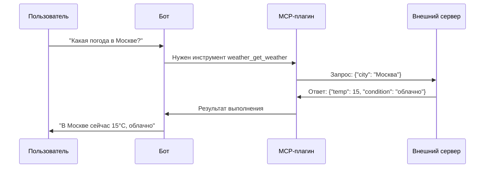
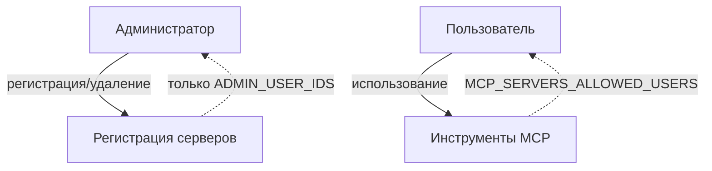

# Chapter 16: MCP-сервер

В [предыдущей главе](15_терминал.md) мы узнали, как **Терминал** позволяет боту выполнять команды прямо на сервере — проверять место на диске, читать логи, управлять процессами. Это мощно, но представьте: у вас есть три разных сервера — один умеет проверять погоду, другой конвертирует валюты, третий ищет рейсы. Вы хотите подключить их все к боту. Копировать код каждого сервиса внутрь бота? Это как тащить весь магазин в свою квартиру, когда можно просто заказать доставку. Вот здесь на сцену выходит **MCP-сервер** — универсальный «разъём» для подключения внешних способностей.

## Зачем нужен MCP-сервер?

Представьте, что ваш бот — это смартфон. Сейчас в нём есть встроенные приложения: камера, калькулятор, заметки. Но ведь вы можете зайти в магазин приложений и установить **любую программу** — банк, такси, переводчик. Приложения не живут внутри телефона «навсегда», они подключаются по стандартному протоколу и работают, пока нужны.

**MCP-сервер** — это именно такой «магазин приложений» для нашего бота. Он позволяет:
- **Подключать внешние сервисы** — без переписывания кода бота
- **Использовать единый язык** — все серверы «говорят» на одном протоколе MCP
- **Менять инструменты на лету** — добавил сервер, удалил сервер, не перезагружая бота
- **Делиться способностями** — один MCP-сервер может работать с множеством ботов

### Конкретный пример

Ольга — владелица небольшого турагентства. Она настроила бота для клиентов, но хочет, чтобы тот мог:
- Сообщать актуальную погоду в пункте назначения
- Конвертировать цены в валюту клиента
- Проверять наличие авиабилетов

Вместо того чтобы программировать это самостоятельно, она находит три готовых MCP-сервера и просто «втыкает» их в бота. Через 5 минут бот уже умеет всё это!

## Как работает MCP: простая аналогия

Представьте ресторан с открытой кухней:

```
┌─────────────────────────────────────────┐
│           РЕСТОРАН (ваш бот)            │
│                                         │
│   Официант принимает заказ у клиента    │
│         ↓                               │
│   Шеф решает, какое блюдо готовить      │
│         ↓                               │
│   Если нужна пицца → звонит в ПИЦЦЕРИЮ  │
│   Если нужен стейк → звонит в МЯСНОЙ    │
│   Если нужен суши → звонит в СУШИ-БАР   │
│         ↓                               │
│   Получает готовое блюдо и несёт клиенту │
└─────────────────────────────────────────┘
```

MCP-серверы — это «пиццерия», «мясной», «суши-бар». Бот-ресторан не умеет готовить пиццу сам, но знает, **кому позвонить** и **как сделать заказ**.

## Два способа «позвонить»: HTTP и stdio

У нашего бота есть два «телефона» для связи с внешними серверами:

| Способ | Когда использовать | Аналогия |
|--------|-------------------|----------|
| **HTTP** | Сервер где-то в интернете | Звонок в другой город |
| **stdio** | Программа прямо на этом сервере | Разговор с соседом через стенку |

### HTTP-транспорт: классический вариант

Сервер работает постоянно, ждёт запросов по сети. Как веб-сайт.

```python
# Пример регистрации HTTP-сервера погоды
{
  "server_name": "weather_service",
  "base_url": "http://example.com/api",
  "api_key": "секретный_ключ_123",
  "description": "Погода по всему миру"
}
```

### stdio-транспорт: программа-сосед

Бот запускает программу как дочерний процесс и «разговаривает» через стандартные потоки ввода-вывода. Удобно для локальных скриптов.

```python
# Пример регистрации stdio-сервера калькулятора
{
  "server_name": "calculator",
  "transport": "stdio",
  "command": "python",
  "args": ["mcp_stdio_server.py"]
}
```

## Настройка: первые шаги

Давайте включим поддержку MCP-серверов. Добавьте в файл `.env`:

```bash
# Включаем MCP-серверы
ENABLE_MCP_SERVERS=true

# Кому разрешено (* — всем)
MCP_SERVERS_ALLOWED_USERS=*

# Серверы по умолчанию (имя:url)
DEFAULT_MCP_SERVERS=weather:http://localhost:8080
```

Конфигурация сохраняется в файл `bot/config/mcp_servers.json`. Бот сам создаст его при первой регистрации сервера.

## Жизненный цикл: от регистрации до ответа

Посмотрим, что происходит «под капотом» при типичном запросе:



## Регистрация сервера: только для администраторов

Подключить новый сервер может только владелец бота. Это как добавлять приложения в телефон — только хозяин решает, что устанавливать.

### Через чат с ботом

```
Зарегистрируй MCP-сервер с именем weather_service, 
URL http://localhost:8080 и ключом API_KEY_123
```

### Программно (из кода плагина)

```python
# Регистрация HTTP-сервера
await plugin.register_server(
    server_name="weather_service",
    user_id=123456789,  # ID администратора
    base_url="http://localhost:8080",
    api_key="API_KEY_123",
    description="Погода по всему миру"
)
```

```python
# Регистрация stdio-сервера
await plugin.register_server(
    server_name="calculator",
    user_id=123456789,
    transport="stdio",
    command="python",
    args=["examples/mcp_stdio_server.py"],
    description="Простой калькулятор"
)
```

## Как бот узнаёт, что умеет сервер?

При регистрации бот спрашивает сервер: «А что ты умеешь?» — и получает список инструментов в формате [OpenAI Function Calling](06_помощник_openai.md).

Для HTTP-сервера бот делает запрос:

```python
# Бот запрашивает список инструментов
GET /tools

# Сервер отвечает:
[
  {
    "name": "get_weather",
    "description": "Получить погоду для города",
    "parameters": {
      "type": "object",
      "properties": {
        "city": {"type": "string", "description": "Название города"}
      },
      "required": ["city"]
    }
  }
]
```

Для stdio-сервера то же самое, но через «разговор» с запущенной программой.

## Вызов функции: когда ИИ решает «позвонить»

Когда пользователь спрашивает про погоду, [Помощник OpenAI](06_помощник_openai.md) видит инструмент `weather_service_get_weather` и решает его использовать.

```python
# Внутри плагина: вызов функции на сервере
async def call_mcp_function(self, server_name, function_name, **kwargs):
    # Для HTTP-транспорта
    async with httpx.AsyncClient() as client:
        response = await client.post(
            urljoin(base_url, "/execute"),
            json={"name": function_name, "arguments": kwargs}
        )
        return response.json()
```

Имя инструмента автоматически получает префикс: `weather_service_get_weather` вместо просто `get_weather`. Это позволяет не путать одинаковые функции от разных серверов.

## Создаём свой MCP-сервер за 10 минут

### Простейший HTTP-сервер на Python

```python
# mcp_server_example.py — сохраните и запустите
from fastapi import FastAPI

app = FastAPI()

@app.get("/tools")
def list_tools():
    return [{
        "name": "hello",
        "description": "Поприветствовать пользователя",
        "parameters": {
            "type": "object",
            "properties": {
                "name": {"type": "string"}
            },
            "required": ["name"]
        }
    }]

@app.post("/execute")
def execute(request: dict):
    if request["name"] == "hello":
        name = request["arguments"]["name"]
        return {"result": f"Привет, {name}! 👋"}
```

```bash
# Установка и запуск
pip install fastapi uvicorn
uvicorn mcp_server_example:app --port 8080
```

### Простейший stdio-сервер

```python
# mcp_stdio_server.py
from mcp.server.fastmcp import FastMCP

mcp = FastMCP("Мой сервер")

@mcp.tool()
def add(a: int, b: int) -> int:
    """Сложить два числа"""
    return a + b

@mcp.tool()
def greeting(name: str) -> str:
    """Поприветствовать"""
    return f"Привет, {name}!"

if __name__ == "__main__":
    mcp.run(transport="stdio")
```

```bash
# Запускаем через клиента (или регистрируем в боте)
pip install mcp
python mcp_stdio_server.py
```

## Безопасность: кто управляет, кто пользуется



- **Регистрация и удаление** — только администраторы (переменная `ADMIN_USER_IDS`)
- **Использование инструментов** — все или избранные (переменная `MCP_SERVERS_ALLOWED_USERS`, `*` для всех)

## Управление серверами через чат

Посмотреть список подключённых серверов:

```
Покажи все MCP-серверы
```

Или командой:

```
/mcp_servers
```

Удалить сервер (администратор):

```
Удали MCP-сервер weather_service
```

## Внутри плагина: ключевые части

Файл `bot/plugins/mcp_server.py` содержит три важных зоны:

### 1. Хранение конфигурации

```python
def __init__(self):
    self.servers = {}           # Все зарегистрированные серверы
    self.sessions = {}          # Активные stdio-соединения
    self.config_path = ...      # Путь к mcp_servers.json
    self.load_servers_config()  # Загружаем при старте
```

### 2. Получение спецификаций для ИИ

```python
def get_spec(self) -> List[Dict]:
    specs = []
    
    # Сначала функции управления (регистрация, список, удаление)
    specs.append({...})  # register_mcp_server
    specs.append({...})  # list_mcp_servers  
    specs.append({...})  # remove_mcp_server
    
    # Потом все инструменты от всех серверов с префиксами
    for server_name, config in self.servers.items():
        for tool in config["tools"]:
            tool["name"] = f"{server_name}_{tool['name']}"
            specs.append(tool)
    
    return specs
```

### 3. Выполнение запроса

```python
async def execute(self, function_name, helper, **kwargs):
    # Управляющие команды
    if function_name == "register_mcp_server":
        return await self.register_server(**kwargs)
    
    # Вызов внешнего инструмента
    for server_name in self.servers:
        if function_name.startswith(f"{server_name}_"):
            real_name = function_name[len(server_name)+1:]
            return await self.call_mcp_function(
                server_name, real_name, **kwargs
            )
```

## Сравнение с другими «расширителями» бота

| Возможность | [Менеджер плагинов](09_менеджер_плагинов.md) | [Система навыков](12_система_навыков.md) | **MCP-сервер** |
|-------------|-------------------------------------------|----------------------------------------|----------------|
| Что это | Внутренние плагины бота | Пользовательские скрипты | Внешние сервисы |
| Где выполняется | Внутри процесса бота | Внутри процесса бота | На другом сервере/процессе |
| Язык | Python | Python (или другой) | Любой (через протокол MCP) |
| Перезапуск бота | Нужен для обновления | Нужен для обновления | **Не нужен** |
| Масштабирование | Ограничено сервером бота | Ограничено сервером бота | Распределённая архитектура |

## Итоги

В этой главе мы узнали, как **MCP-сервер** превращает бота из «монолита» в «экосистему»:

- **Протокол MCP** — единый язык для подключения внешних инструментов
- **HTTP-транспорт** — для удалённых сервисов в интернете
- **stdio-транспорт** — для локальных программ на том же сервере
- **Префиксы имён** — защита от конфликтов между серверами
- **Разделение прав** — администраторы управляют, пользователи пользуются

Теперь ваш бот может «позвонить» в любой сервис мира — будь то погода, финансы, переводы или что угодно ещё. Главное, чтобы тот сервис «говорил» на языке MCP.

В [следующей главе](17_утилиты.md) мы заглянем в «ящик с инструментами» разработчика — узнаем о вспомогательных функциях, которые делают код бота чище, надёжнее и удобнее в поддержке. Это как набор отвёрток для мастера: мелочь, но без них никуда!

---

Generated by MultiAgent