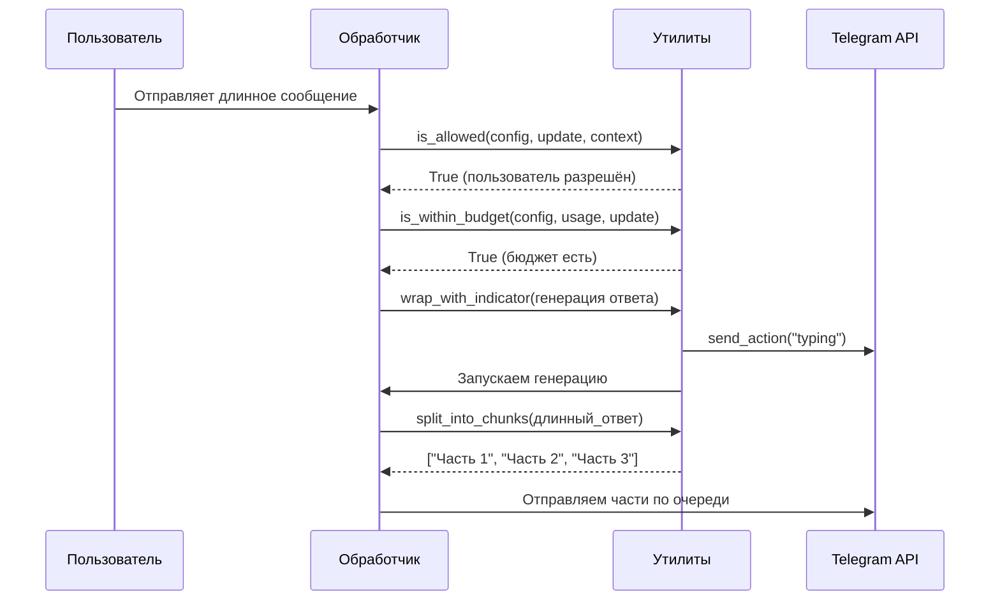

# Chapter 17: Утилиты

В [предыдущей главе](16_mcp_сервер.md) мы узнали, как **MCP-сервер** позволяет боту подключать внешние способности по единому протоколу — как в магазин приложений. Но представьте: у вас есть все эти мощные инструменты, но каждый раз, когда боту нужно проверить «а разрешён ли этот пользователь?», «а не превысил ли он лимит?», «а как разбить длинное сообщение на части?» — приходится писать один и тот же код снова и снова. Это как если бы в ресторане каждый повар сам резал овощи, сам мыл посуду и сам считал сдачу вместо того, чтобы воспользоваться общей кухней и кассой. Вот здесь на сцену выходят **Утилиты** — универсальный «ящик с инструментами» для всего бота.

## Зачем нужны Утилиты?

Представьте, что вы — новый сотрудник в большом офисе. В вашем ящике стола лежит:
- **Ножницы** — чтобы быстро что-то разрезать
- **Калькулятор** — чтобы посчитать
- **Скотч** — чтобы склеить
- **Дырокол** — чтобы подготовить бумаги

Вы не бегаете по этажу в поисках ножниц — они всегда под рукой. **Утилиты** — это именно такой «ящик с инструментами» для нашего бота. Они содержат:

- **Проверку прав доступа** — кто может пользоваться ботом, кто админ
- **Работу с бюджетами** — сколько токенов потратил пользователь
- **Форматирование сообщений** — как красиво разбить длинный текст
- **Работу с медиа** — как обработать изображения перед отправкой

### Конкретный пример

Алексей — владелец небольшого образовательного бота. У него есть:
- 50 студентов с разными тарифами (кто-то платный, кто-то бесплатный)
- Групповые чаты, где бот должен отвечать только если там есть авторизованный студент
- Длинные лекции в формате Markdown, которые нужно аккуратно разбить на сообщения
- Генерируемые графики, которые иногда слишком большие для Telegram

Без утилит Алексей копировал бы один и тот же код в десятки файлов. С утилитами — просто вызывает готовые функции.

## Ключевые концепции Утилит

Давайте разберём утилиты по полочкам, как инструменты в ящике.

### 1. Проверка прав и доступа

Это как **охранник у входа** — решает, пускать ли человека или нет.

```python
# Проверяем, разрешён ли пользователь
async def check_user(update, context, config):
    if await is_allowed(config, update, context):
        return "Добро пожаловать!"
    return "Извините, доступ запрещён."
```

Функция `is_allowed` проверяет три вещи: список разрешённых пользователей, является ли пользователь админом, или есть ли в групповом чате хотя бы один авторизованный участник.

```python
# Проверяем, является ли пользователь админом
def check_admin(user_id, config):
    if is_admin(config, user_id):
        return "У вас права администратора"
    return "Обычный пользователь"
```

Админы получают особые привилегии: безлимитный бюджет, доступ к настройкам.

### 2. Управление бюджетом

Это как **счётчик электроэнергии** — показывает, сколько потрачено и сколько осталось.

```python
# Сколько денег осталось у пользователя?
def check_budget(config, usage, update):
    remaining = get_remaining_budget(config, usage, update)
    if remaining > 0:
        return f"Осталось: ${remaining:.2f}"
    return "Бюджет исчерпан!"
```

Бюджет работает по периодам: дневной, месячный или за всё время. Система автоматически считает потраченные токены и вычитает их из лимита.

```python
# Добавляем использованные токены в учёт
def track_usage(usage, config, user_id, tokens):
    add_chat_request_to_usage_tracker(usage, config, user_id, tokens)
    # Теперь в статистике учтён этот запрос
```

### 3. Форматирование и разбиение сообщений

Telegram ограничивает длину сообщения (4096 символов). Это как **письмо, которое не пролезает в почтовый ящик** — нужно разрезать аккуратно, чтобы не испортить.

```python
# Длинный текст разбиваем на части
long_text = "Очень длинная лекция о Python..." * 1000
chunks = split_into_chunks(long_text, chunk_size=4096)
# Получаем список коротких сообщений, каждое — цельное
```

Особенно важно сохранить Markdown-форматирование: если открыли `**жирный текст`, нужно закрыть его `**` в том же сообщении, иначе Telegram сломается.

```python
# Экранируем опасные символы Markdown
safe_text = escape_markdown("Текст со *звёздочками* и _подчёркиваниями_")
# Теперь символы не сломают форматирование
```

### 4. Индикаторы активности

Когда бот долго думает, пользователь нервничает: «А работает ли он?» Это как **песочные часы на экране** — показывают, что процесс идёт.

```python
# Показываем "печатает..." пока бот думает
async def smart_reply(update, context, slow_function):
    return await wrap_with_indicator(
        update, context, 
        slow_function,
        chat_action="typing"  # Пользователь видит "Бот печатает..."
    )
```

Класс `BusyStatusMessage` идёт дальше — он показывает прогресс выполнения плана агента: какие шаги уже сделаны, какие в процессе, сколько прошло времени.

### 5. Работа с медиа и изображениями

Telegram ограничивает размер изображений. Это как **фото, которое не влезает в рамку** — нужно уменьшить, сохранив пропорции.

```python
# Проверяем и уменьшаем изображение при необходимости
def prepare_image(path):
    file_obj, format = resize_image_if_needed(path, max_dimension=10000)
    # Возвращает BytesIO — готовый к отправке объект
    return file_obj
```

```python
# Кодируем изображение для отправки в API
def encode_for_api(image_file):
    base64_string = encode_image(image_file)
    # Получаем: data:image/jpeg;base64,/9j/4AAQ...
    return base64_string
```

### 6. Прямые результаты от плагинов

Когда плагин хочет отправить что-то специфичное — фото, файл, гифку — он возвращает структуру `direct_result`. Это как **курьер с конкретной посылкой** вместо обычного письма.

```python
# Пример: плагин хочет отправить график
result = {
    "direct_result": {
        "kind": "photo",      # что отправляем
        "format": "path",     # откуда берём
        "value": "/tmp/plot.png"  # путь к файлу
    }
}
```

Функция `handle_direct_result` разбирает эту структуру и вызывает нужный метод Telegram API: `reply_photo`, `reply_document`, `reply_animation` и т.д.

## Как это работает под капотом

Давайте проследим путь одного запроса через утилиты — от сообщения пользователя до ответа.



### Пошаговый разбор проверки доступа

```python
# Шаг 1: Проверяем, не админ ли пользователь
def is_admin(config, user_id):
    admin_ids = config['admin_user_ids'].split(',')
    return str(user_id) in admin_ids
```

```python
# Шаг 2: Проверяем список разрешённых
def is_allowed(config, update, context):
    # Особый случай: все разрешены
    if config['allowed_user_ids'] == '*':
        return True
    
    # Ищем ID пользователя в разных местах update
    user = find_user_in_update(update)
    
    # Проверяем личный доступ
    allowed_ids = config['allowed_user_ids'].split(',')
    if str(user.id) in allowed_ids:
        return True
```

```python
# Шаг 3: Для групп — проверяем, есть ли авторизованный участник
    if is_group_chat(update):
        for allowed_id in allowed_ids:
            if await is_user_in_group(update, context, allowed_id):
                return True  # Хоть кто-то из своих есть в чате
    return False
```

### Пошаговый разбор разбиения на части

```python
# Шаг 1: Если текст короткий — не заморачиваемся
if len(text) <= 4096:
    return [text]
```

```python
# Шаг 2: Сначала режем слишком длинные строки
for line in text.split('\n'):
    if len(line) > 3800:
        # Режем кусками с переносом
        parts = [line[i:i+3800] for i in range(0, len(line), 3800)]
```

```python
# Шаг 3: Собираем чанки, следя за Markdown
markdown_stack = []  # Что открыли, но не закрыли

for line in processed_lines:
    if len(current_chunk) + len(line) > 4096:
        # Закрываем всё открытое перед разрывом
        for md in reversed(markdown_stack):
            current_chunk += md
```

```python
# Шаг 4: В начале нового чанка — открываем снова
        chunks.append(current_chunk)
        current_chunk = ""
        for md in markdown_stack:
            current_chunk += md  # Восстанавливаем форматирование
```

### Пошаговый разбор индикатора активности

```python
class BusyStatusMessage:
    def __init__(self, update, context, description, plan_provider=None):
        self.description = description  # "Генерирую ответ..."
        self.plan_provider = plan_provider  # Функция, дающая текущий план
        self.interval = 30.0  # Обновляем каждые 30 секунд
```

```python
    async def _run(self):
        while not self._stopped:
            text = self._text()  # Формируем сообщение с прогрессом
            
            if self.message is None:
                await self._send()   # Первое отправление
            else:
                await self._edit()   # Обновляем существующее
            
            await asyncio.sleep(self.interval)
```

```python
    def _plan_lines(self):
        # Получаем шаги плана от агента
        tasks = self.plan_provider() or []
        
        for task in tasks:
            status = task.get("status", "pending")
            icon = {"pending": "⏳", "in_progress": "🔄", 
                   "completed": "✅", "cancelled": "⛔"}.get(status, "•")
            lines.append(f"{icon} {task['content']}")
        return lines
```

## Практический пример: защищённый бот с бюджетами

Давайте соберём всё вместе — создадим мини-бота, который использует утилиты.

```python
# Конфигурация бота
config = {
    'allowed_user_ids': '123456,789012',  # Кто может писать
    'admin_user_ids': '123456',           # Кто админ
    'user_budgets': '5.0,2.0',            # Бюджеты в долларах
    'budget_period': 'monthly',
    'token_price': 0.002,                 # Цена за 1000 токенов
    'enable_quoting': True,
}
```

```python
# Хранилище использования (из главы [Отслеживание использования](05_отслеживание_использования.md))
usage = {}

async def handle_message(update, context):
    # Проверка 1: есть ли доступ?
    if not await is_allowed(config, update, context):
        await update.message.reply_text("Извините, вас нет в списке.")
        return
    
    # Проверка 2: хватит ли бюджета?
    if not is_within_budget(config, usage, update):
        await update.message.reply_text("Бюджет исчерпан. Обратитесь к админу.")
        return
```

```python
    # Показываем, что бот работает
    async def generate_response():
        # ... долгая генерация ответа ...
        return "Очень длинный ответ " * 500
    
    # С индикатором "печатает..."
    response = await wrap_with_indicator(
        update, context, 
        generate_response,
        chat_action="typing"
    )
```

```python
    # Разбиваем и отправляем
    chunks = split_into_chunks(response)
    for i, chunk in enumerate(chunks):
        await update.message.reply_text(
            chunk,
            reply_to_message_id=get_reply_to_message_id(config, update) if i == 0 else None
        )
    
    # Учитываем использованные токены
    tokens_used = len(response) // 4  # Грубая оценка
    add_chat_request_to_usage_tracker(usage, config, user_id, tokens_used)
```

## Когда сообщение слишком длинное: отправка файлом

Иногда даже разбиения недостаточно — например, ответ с кодом из [Интерпретатора кода](14_интерпретатор_кода.md). Тогда утилиты создают красивый HTML-файл:

```python
# Если много частей ИЛИ есть блоки кода — отправляем файлом
if len(chunks) > 3 or '```' in response:
    await send_long_response_as_file(config, update, response, "анализ_данных")
    # Пользователь получает: analysis_data_2024-01-15_10-30-00.html
```

Функция `send_long_response_as_file` использует `HTMLVisualizer` (из `html_utils.py`) для создания красивого HTML с подсветкой синтаксиса, затем отправляет как документ.

## Заключение

В этой главе мы заглянули в **ящик с инструментами** бота — модуль `utils.py`. Утилиты — это невидимые помощники, которые делают работу бота надёжной и приятной для пользователей:

- **Проверка прав** защищает бота от нежелательных гостей
- **Бюджеты** позволяют справедливо распределять ресурсы
- **Разбиение сообщений** обходит ограничения Telegram
- **Индикаторы активности** успокаивают нервных пользователей
- **Работа с медиа** адаптирует контент под требования платформы

Без этих утилит каждый обработчик придумывал бы велосипед заново. С ними — вы просто берёте нужный инструмент из ящика и решаете задачу.

Мы прошли долгий путь от базовых обработчиков до сложных систем. В следующей главе мы подведём итоги и посмотрим, как всё это великолепие работает вместе — от первого сообщения пользователя до финального ответа, собирая воедино всё, что мы изучили: [Обработчик телеграм-бота](01_обработчик_телеграм_бота.md), [Настройки пользователя](02_настройки_пользователя.md), [Режимы чата](03_режимы_чата.md) и все остальные главы нашего путешествия.

---

Generated by MultiAgent