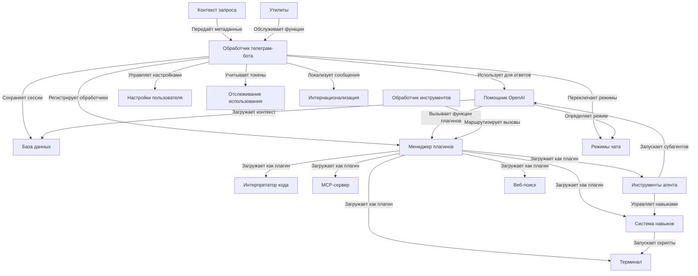

# Tutorial: chatgpt-telegram-bot

Это **Telegram-бот с ИИ-ассистентом**, который интегрируется с языковыми моделями через **LLMGateway** для генерации ответов, обработки изображений, аудио и выполнения сложных задач. Бот поддерживает **множество режимов работы** (чат-режимы), **плагины** для расширения функциональности, **систему навыков (skills)** для локальных скриптов и **долговременную память (Hindsight)**. Пользователи могут управлять сессиями, настройками и плагинами через интерактивные меню Telegram.

**Source Repository:** [None](None)

## Chapters

1. [Обработчик телеграм-бота](01_обработчик_телеграм_бота.md)
2. [Настройки пользователя](02_настройки_пользователя.md)
3. [Режимы чата](03_режимы_чата.md)
4. [Интернационализация](04_интернационализация.md)
5. [Отслеживание использования](05_отслеживание_использования.md)
6. [Помощник OpenAI](06_помощник_openai.md)
7. [Контекст запроса](07_контекст_запроса.md)
8. [База данных](08_база_данных.md)
9. [Менеджер плагинов](09_менеджер_плагинов.md)
10. [Обработчик инструментов](10_обработчик_инструментов.md)
11. [Инструменты агента](11_инструменты_агента.md)
12. [Система навыков](12_система_навыков.md)
13. [Веб-поиск](13_веб_поиск.md)
14. [Интерпретатор кода](14_интерпретатор_кода.md)
15. [Терминал](15_терминал.md)
16. [MCP-сервер](16_mcp_сервер.md)
17. [Утилиты](17_утилиты.md)

---

Generated by MultiAgent